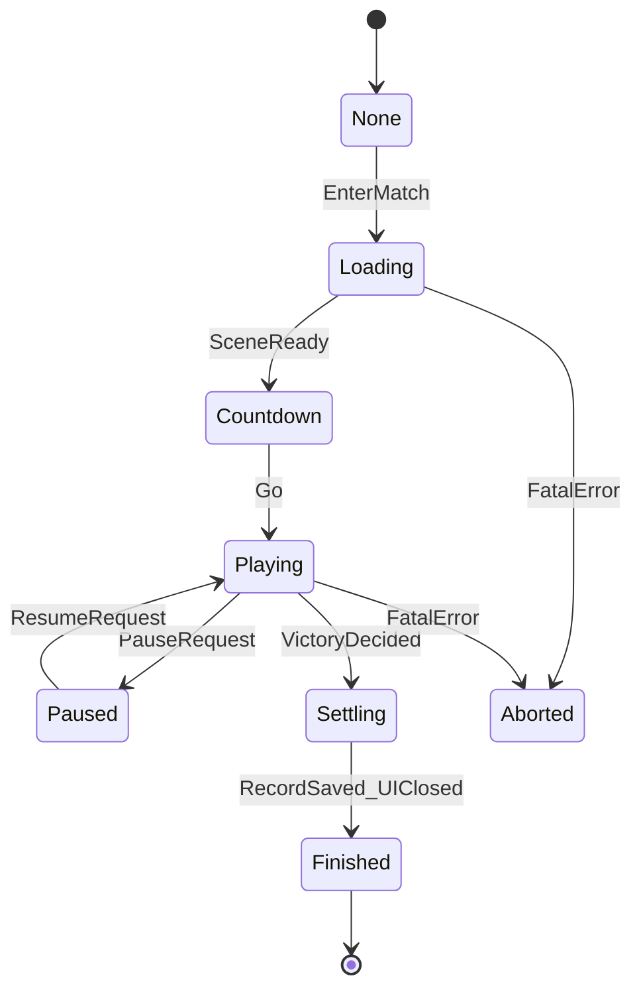

# MOBA 对局信息、流程、胜负判定与记录模块设计文档

| 项 | 内容 |
|----|------|
| 文档版本 | 1.2 |
| 适用场景 | **毕业设计级**俯视角 MOBA；**单机端到端演示**冻结见 **`毕设演示-端到端场景与界面流转.md`**；局域网 / Mirror 为扩展，非演示必选 |
| 关联文档 | **`毕设演示-端到端场景与界面流转.md`**、`对局时间模块设计文档.md`、`工程模块与命名空间-现行实现总览.md`、`局内输入与NewInputSystem接轨设计.md`；网络见 `NetworkSyncService.md`（扩展） |
| 非目标（首版可不实现） | 商业化天梯 ELO、断线重连完整方案、跨局云端存档、反作弊与录像回放 |

---

## 1. 文档目的与范围

### 1.1 目的

在工程内显式定义 **一局对战（Match）** 从进入到结束的 **信息流与控制流**，统一 **胜负条件判定** 的语义与触发顺序，并约定 **局末统计与记录** 的最小数据面，便于：

- 程序实现时有单一职责边界（对局流程 vs 战斗逻辑 vs UI）；
- 论文中表述「状态机—事件—数据持久化」链条；
- 与 **`IMatchTime` / 对局时间**、未来网络权威模型对齐。

### 1.2 范围

| 包含 | 不包含 |
|------|--------|
| 局内阶段划分、开始/结束、暂停策略对接约定 | 具体 UI Prefab 与美术资源 |
| 胜负条件类型、优先级、可扩展挂载点 | 完整电竞规则集（BP、Ban、符文等） |
| 局末摘要数据结构、本地记录策略 | 服务端数据库与账号体系 |
| **战绩（生涯汇总 + 战报列表）** 的数据边界与更新链路 | 全球排行榜、实名认证、商业赛季通行证 |
| 与 ECS / 事件总线的订阅边界说明 | 兵线 AI、野区数值的具体公式 |

---

## 2. 术语与核心概念

| 术语 | 定义 |
|------|------|
| **Match（对局）** | 一次「从载入完成到胜负裁定并进入结算」的封闭会话；对应一局游戏实例 ID（本地可用自增 `matchId` 或 GUID）。 |
| **Match Phase（对局阶段）** | 对局在时间上所处的离散阶段，驱动 UI 与部分系统是否允许输入（见 §4）。 |
| **Team（阵营）** | 最小化为两方：`TeamA`、`TeamB`（或 `Blue` / `Red`）；玩家与 AI 英雄绑定阵营 ID。 |
| **Victory Condition（胜利条件）** | 使 **对方阵营失败** 或 **本方达成胜利目标** 的规则；可多条件并存，需定义 **裁定优先级**（§5）。 |
| **Match Outcome（对局结果）** | 枚举：`Victory` / `Defeat` / `Draw`（平局）/ `Aborted`（异常中止）；视角可为「全局」或「相对某一客户端阵营」。 |
| **Match Record（对局记录）** | 一局结束后的 **摘要快照**，用于展示结算界面与可选本地持久化。 |
| **Battle Stats（局内战绩统计）** | 当前局内、按参与者累积的 **实时统计**（击杀、死亡、助攻、插眼数等），用于 TAB 面板与局末写入 `MatchSummary`。 |
| **Career Stats（生涯战绩）** | 跨多局聚合的 **汇总指标**（总场次、胜负平、累计 K/D/A 等），可选按英雄维度拆分；**不等于**单局 `MatchSummary`。 |

---

## 3. 模块划分与职责（建议）

毕业设计体量推荐 **四个协作单元**（在「流程—规则—单局记录」之上增加 **战绩**），边界清晰即可：

```text
MatchFlow（流程编排）
    ├─ 驱动 Phase 迁移；订阅胜负事件；调用 Begin/End MatchTime
    ├─ 通知 UI / 场景加载 / 网络层（若有）
MatchRules（规则与判定）
    ├─ 注册胜利条件检查器；产出「裁定请求」或确定性事件
MatchRecord（单局记录）
    ├─ 局末组装 MatchSummary；写入战报列表（History）；触发 Career 更新
CareerStats（战绩：聚合与展示门面）
    ├─ 订阅 MatchRecordBuilt / History 写入完成；刷新生涯汇总并持久化
    ├─ 可选：按英雄、按模式的二级统计（毕设可裁剪）
```

| 模块 | 职责 | 禁止承担 |
|------|------|----------|
| **MatchFlow** | 阶段状态机、开局/终局编排、与 `IMatchTimeControl` 对齐 | 具体伤害公式、技能 CD |
| **MatchRules** | 塔/基地血量阈值、投降票数、超时比分等 **布尔判定** | UI 动画、音效播放 |
| **MatchRecord** | 组装 `MatchSummary`、append **战报历史**、触发「生涯增量更新」事件 | 跨局累计胜率（交给 CareerStats） |
| **CareerStats** | **`PlayerCareerSnapshot`** 维护、读取、持久化；供「个人战绩页」绑定 | 局内实时 HUD 击杀播报逻辑 |

---

## 4. 对局流程（Phase 状态机）

### 4.1 推荐阶段（可按毕设裁剪）



| Phase | 玩家输入 / 战斗 | 说明 |
|-------|-----------------|------|
| **None** | — | 未进入对局或已清理完毕。 |
| **Loading** | 通常锁定 | 载入场景、生成单位、同步初始黑板；完了进入 Countdown。 |
| **Countdown** | 可选锁定 | 开局倒计时；结束调用 `BeginMatch()`（对局时间清零起点）。 |
| **Playing** | 正常 | 核心战斗阶段；**胜负判定仅在此阶段生效**（或可配置是否允许 Loading 末尾预裁定）。 |
| **Paused** | 按设计 | 与 `timeScale` 或内部 `_paused` 对齐，见对局时间文档。 |
| **Settling** | 锁定操作 | 播放结算、展示 `MatchSummary`；禁止再次触发战斗胜负逻辑。 |
| **Finished** | — | 释放引用、可选返回大厅；`EndMatch()`。 |
| **Aborted** | — | 加载失败、全员掉线等；结果记 `Aborted`。 |

### 4.2 与对局时间的挂钩

- **`Countdown → Playing`**：建议在 **正式进入 Playing 的首帧或倒计时结束回调** 调用 **`BeginMatch()`**，保证 `MatchElapsed` 与玩家可操作时刻一致。
- **`Settling` / `Finished`**：调用 **`EndMatch()`**；是否清空 `TimingTask` 由流程编排器统一调用（参阅 `对局时间模块设计文档.md`）。

### 4.3 毕设演示冻结（单机端到端）

以下与 **`毕设演示-端到端场景与界面流转.md`** 一致，用于 **闭环验收**，避免实现分叉。

| 冻结项 | 约定 |
|--------|------|
| **联网** | **不考虑局域网**；胜负与 `MatchSummary` 均在 **本机即时裁定与展示**。 |
| **唯一胜利条件（演示）** | 采用 **§5.2 V1**：**敌方基地 / 核心建筑被摧毁** → 本方胜利；不实现投降（V3）、超时决胜（V2）亦可暂不启用。 |
| **失败语义** | 若演示场景仅玩家一方可操作：敌方基地毁 → **玩家 Victory**；玩家基地毁 → **Defeat**（需在 `MatchRules` 与阵营绑定上一致）。 |
| **结算持久化** | 闭环最小验收：**L0 内存 + 结算 UI**；L1 战报 JSON / Career **可选**。 |
| **结算呈现** | 默认 **局内场景上叠加全屏结算 Panel**（不强制单独 Settlement 场景）。 |

**`BeginMatch` / `EndMatch` 锚点 Checklist（对接 `IMatchTimeControl`）**

| 调用 | 建议锚点 | 说明 |
|------|----------|------|
| **`BeginMatch()`** | **`Countdown → Playing`** 的同一时刻（倒计时结束回调首帧或 Countdown 长度为 0 时进入 Playing 的瞬间） | 此前不得累计 `MatchElapsed`。 |
| **`EndMatch()`** | **`Settling` 展示 `MatchSummary` 之后**，在 **`Finished → 返回主菜单`** 之前调用 | 确保结算 UI 读取的对局时长仍以 **Begin～End** 为闭区间；若 `TimingTask` 需随局终清空，由 **MatchFlow** 在此前后显式编排。 |

**Phase 与场景迁移** 的逐步触发见 **`毕设演示-端到端场景与界面流转.md` §3～§4**。

---

## 5. 胜负条件判定

### 5.1 设计原则

1. **单一裁定入口**：所有条件满足后，只在一个地方触发 **`MatchVictoryDecided`**（或等价事件），避免多处 `GameOver`。
2. **优先级**：多条件同时达成时，按 **预先定义的优先级表** 出一条对外结果（论文可列表说明）。
3. **确定性**：单机下判定顺序固定。**局域网扩展** 下以主机/服务端裁决为准，客户端仅表现（演示冻结不涉及，见 §4.3）。

### 5.2 常见条件类型（毕设可选子集）

| ID | 条件说明 | 典型数据源 | 建议优先级（示例） |
|----|----------|------------|-------------------|
| **V1** | 摧毁敌方 **基地 / 核心建筑** | 建筑实体死亡事件或血量 ≤ 0 | 高（核心玩法） |
| **V2** | **超时** + 比分高者胜 | `MatchElapsed`、阵营击杀数 / 经济差 | 中 |
| **V3** | **投降** vote 通过 | 队伍投票计数 | 中 |
| **V4** | 敌方 **全员长时间无法复活** 且本方存活（可选） | 复活系统状态 | 低 |
| **V5** | **平局**（超时且比分相同，或双基地同时毁） | 同上 | 明确并列规则 |

实现上可采用 **`IVictoryCondition`** 接口：`bool Evaluate(MatchContext ctx, out VictoryReason reason)`，由 **`MatchRules`** 每帧或事件驱动调用。

### 5.3 `MatchContext`（上下文最小字段）

便于论文中画「判定依赖图」：

| 字段 | 用途 |
|------|------|
| `Phase` | 非 `Playing` 时可跳过判定 |
| `ElapsedTime` | 超时、限时模式 |
| `TeamStates[]` | 每阵营：基地存活、核心塔数量、投降票数 |
| `Scoreboard` | 击杀、经济、推塔数等 |

---

## 6. 对局信息与记分板（Scoreboard）

### 6.1 运行时信息（Match Info）

建议在 **`MatchRuntimeState`**（或静态会话服务）中维护：

- `matchId`、`randomSeed`（若需要复现）；
- `teamCount`、`playerBindings`（本地玩家所属阵营）；
- **`Scoreboard`**：结构化字典或 POCO，按阵营索引；
- **可选**：迷雾、兵线阶段索引（与胜负无关的可不放）。

### 6.2 更新策略

- **事件驱动为主**：击杀、推塔、占领目标点 → 发布 **`ScoreboardChanged`**，UI 订阅增量刷新。
- **节流**：同一帧多事件可合并一次 UI 刷新（毕业设计可选）。

---

## 7. 局末记录（Match Record）

### 7.1 `MatchSummary` 建议字段（最小可答辩）

| 字段 | 类型 | 说明 |
|------|------|------|
| `matchId` | string / long | 局标识 |
| `endedAtUtc` / `matchDuration` | DateTime / float | 结束时间与持续时长 |
| `outcomeForLocalPlayer` | enum | 本地玩家视角胜/负/平/中止 |
| `victoryReason` | enum / string | 便于论文说明「因何结束」 |
| `teams[]` | struct | 阵营名、是否胜利、总击杀、经济、推塔数 |
| `participants[]` | struct | 英雄 ID、玩家名占位、K/D/A、伤害占比（可选） |

### 7.2 持久化策略（毕设推荐）

| 级别 | 做法 | 用途 |
|------|------|------|
| **L0** | 仅内存 + 结算 UI | 最快验收 |
| **L1** | `Application.persistentDataPath` 写 **JSON 数组**（最近 N 局） | 论文「本地战绩记录」截图 |
| **L2** | ScriptableObject 仅编辑器调试 | 不推荐作为玩家存档 |

隐私与篇幅：**不写真实身份证号**；演示账号可用占位字符串。

### 7.3 结算 UI 最小展示集（与 §7.1 `MatchSummary` 对齐）

单机端到端闭环下，结算 Panel **至少**绑定下列展示（字段缺省可用占位符 `"—"`）：

| UI 元素（建议） | 数据来源（`MatchSummary`） | 说明 |
|-----------------|----------------------------|------|
| 标题文案 | `outcomeForLocalPlayer` | 如「胜利」/「失败」/「平局」/「中止」 |
| 结束原因一行 | `victoryReason` | 演示冻结为基地摧毁时，可固定文案「摧毁敌方基地」 |
| 本局时长 | `matchDuration` 或 `endedAtUtc - started` | 格式 `mm:ss` 即可 |
| 可选：阵营摘要一行 | `teams[]` 中与本方相关的击杀差或推塔数 | 无数据时可隐藏 |
| 主按钮「返回主菜单」 | — | 触发 **Finished**、`EndMatch()`、卸载或切换场景（见端到端文档 §4） |

不强制表格展示 `participants[]`；若有 TAB 或折叠区可列表 **K/D/A**，属加分项非闭环必选。

---

## 8. 战绩模块（局内统计 + 战报 + 生涯汇总）

本节约定 **「战绩」** 与 §7 **单局 `MatchSummary`** 的分工：前者强调 **跨局累积与可查历史**，后者强调 **一局结束时的结构化快照**。

### 8.1 三层结构（建议）

| 层级 | 名称 | 生命周期 | 典型用途 |
|------|------|----------|----------|
| **L-A** | **局内 Battle Stats** | `Playing` 阶段累积，随单位生成而绑定 | 计分板 TAB、击杀播报数据源 |
| **L-B** | **战报 Match History** | 每局结束追加一条（≈ `MatchSummary` 或可序列化子集） | 结算详情、历史战绩列表「最近 N 局」 |
| **L-C** | **生涯 Career Aggregate** | 长期本地存档，按「本地玩家档案」一条汇总 | 个人中心：总场次、总胜率、累计 K/D/A |

说明：**L-B** 可与 §7 的 L1 JSON **共用同一文件或同一数组**，Career 既可每次由 **全量重算**（简单）也可 **`ApplyDelta(MatchSummary)`**（高效）。

### 8.2 局内 Battle Stats（L-A）

| 设计要点 | 说明 |
|----------|------|
| **归属键** | `participantId`（**单机演示**：玩家槽位 / `heroId`+阵营 即可；联网扩展可用 `netId`）。 |
| **事件驱动** | 击杀、死亡、助攻、推塔、参与远古龙（可选）→ **`BattleStatsAccumulator`** 增量更新；与 **`Scoreboard`** 可共享底层计数器或各维护一份由文档约定单一数据源。 |
| **局末导出** | `Playing → Settling` 时由 **`MatchRecord`** 将各参与者 **Battle Stats** 拷贝进 `MatchSummary.participants[]`，避免结算后仍修改局内引用。 |

字段示例（与 §7 对齐）：`kills`、`deaths`、`assists`、`damageDealt`（可选）、`goldEarned`（可选）、`towers`（可选）。

### 8.3 战报列表 / Match History（L-B）

| 设计要点 | 说明 |
|----------|------|
| **条目形态** | 与 `MatchSummary` **同构或为其子集**（字段过多时可 `MatchHistoryEntry` 去掉录像路径等非展示字段）。 |
| **容量** | 仅保留最近 **N** 条（如 20～50），溢出删最旧；论文可说明「控制存储与加载」。 |
| **存储** | `persistentDataPath + "/match_history.json"`（示例）；UTF-8 JSON 数组。 |

### 8.4 生涯汇总 Career Stats（L-C）

**`PlayerCareerSnapshot`（建议最小字段）**

| 字段 | 说明 |
|------|------|
| `profileVersion` | 存档版本号，便于迁移 |
| `totalMatches` | 总场次（是否含 Aborted 需在代码里固定规则） |
| `wins` / `losses` / `draws` | 胜 / 负 / 平 |
| `totalKills` / `totalDeaths` / `totalAssists` | 跨局累加 |
| `lastUpdatedUtc` | 最后更新时间 |

**可选扩展（P+）**：`Dictionary<heroId, HeroCareerMini>`（场次、胜率）；`favoriteHeroId`（可由场次最大值导出）。

### 8.5 更新链路（与事件对齐）

```text
局内事件 → BattleStatsAccumulator（L-A）
       → Settling：MatchRecord 冻结 → MatchSummary
       → MatchRecordBuilt
              ├→ 结算 UI
              ├→ History.Append(MatchSummary 或 Entry)
              └→ CareerStats.ApplyFromSummary(summary) → 写 career.json
```

**幂等**：同一 `matchId` 不得重复计入 Career（`CareerStats` 内维护 `HashSet` 或持久化已处理 id 列表）；异常中止局可按规则 **不计入** 胜负场次仅记 `totalMatches`。

### 8.6 `CareerStats` 模块 API 草案

```csharp
public interface ICareerStatsService
{
    PlayerCareerSnapshot Snapshot { get; }
    IReadOnlyList<MatchHistoryEntry> RecentMatches { get; }

    void ApplyMatchEnded(MatchSummary summary); // 由 MatchRecord 编排调用，内部幂等
    void ReloadFromDisk();
    void SaveToDisk();
}
```

### 8.7 UI 锚点（论文可配图）

| 界面 | 数据源 |
|------|--------|
| 结算面板 | `MatchSummary` |
| 历史战绩列表 | `RecentMatches`（L-B） |
| 个人战绩 / 生涯 | `PlayerCareerSnapshot`（L-C） |
| 局内 TAB | **Battle Stats** 运行时视图 |

### 8.8 非目标（与 §1 一致）

天梯匹配分、全服排名、账号云同步、战绩防伪校验 —— **不在毕设首版范围**；文档中可单列「后续工作」。

---

## 9. 事件与集成（建议命名）

便于与现有 ECS / `UnitDeathEventHub` 等并存：

| 事件名（示例） | 发布时机 | 订阅方 |
|----------------|----------|--------|
| `MatchPhaseChanged` | Phase 迁移 | UI、输入网关 |
| `ScoreboardChanged` | 记分变化 | HUD |
| `VictoryConditionMet` | 某条件逻辑为真（可选调试） | 日志 |
| `MatchVictoryDecided` | 最终裁定 | MatchFlow → Settling、音效 |
| `MatchRecordBuilt` | `MatchSummary` 组装完成 | 结算 UI、**History append**、**CareerStats.Apply** |
| `CareerStatsChanged`（可选） | 生涯汇总写盘后 | 个人战绩页刷新 |

**建筑摧毁**：Gameplay 层应在基地摧毁时抛出 **`CoreObjectiveDestroyed`** 或沿用现有 Impact/死亡管道，由 **`MatchRules`** 订阅并映射到 **V1**。

---

## 10. 单机默认路径与局域网扩展

### 10.1 单机（本文档与毕设演示默认）

| 项目 | 约定 |
|------|------|
| **胜负裁定** | 本地即时运行 **`MatchRules`**，触发 **`MatchVictoryDecided`** |
| **记录** | **`MatchSummary`** 内存 + 结算 UI；可选 L1/L2 |
| **流程与场景** | 与 **`毕设演示-端到端场景与界面流转.md`** 完全一致 |

### 10.2 局域网 / Mirror（扩展阅读，非演示必选）

| 场景 | 胜负裁定 | 记录写入 |
|------|----------|----------|
| **主机权威** | 仅主机运行 `MatchRules.Evaluate`，通过网络消息下发 **`MatchOutcomeDto`** | 主机写记录；客户端可选仅展示 |

客户端 **不信任** 本地推测胜负；实现时采用主机裁定简化同步，详见 **`NetworkSyncService.md`**。

**战绩**：联机时建议 **仅主机**（或服务端）生成权威 `MatchSummary` 并下发；各客户端 **本地 Career** 可为「仅本地玩家一条」的简化模型。

---

## 11. 实现阶段建议（贴合毕设排期）

| 阶段 | 交付 |
|------|------|
| **P0** | Phase：`Loading → Playing → Settling → Finished`；**V1** 基地摧毁胜利；`MatchSummary` 内存版 |
| **P1** | `IMatchTime` 挂钩；**超时平局/胜负**（V2）；JSON **战报列表（L-B）** |
| **P2** | 投降（V3）；Scoreboard 事件与 HUD；**局内 Battle Stats（L-A）** 与 TAB |
| **P3** | Mirror 裁定与下行同步（**论文承诺联机时**再做；**单机演示闭环不依赖**） |
| **P4** | **Career 汇总（L-C）** + 个人战绩页；可选按英雄统计 |

---

## 12. 本章可在论文中的落点

- **需求分析**：功能性条目「对局流程可见、胜负可判定、结果可展示」**及「战绩可追溯（历史列表 + 生涯汇总）」**。
- **总体设计**：状态机图（§4）、模块职责表（§3）、战绩三层模型（§8.1）。
- **详细设计**：胜负优先级表（§5）、数据结构设计（§6–§8）、**数据流（§8.5）**。
- **测试**：列举用例——**演示冻结路径**：摧毁基地胜利；加载失败中止；**重复触发 `MatchRecordBuilt` 不应重复累加 Career**。
- **演示材料**：操作路径与场景迁移见 **`毕设演示-端到端场景与界面流转.md`**；输入键位见 **`局内输入与NewInputSystem接轨设计.md`**。

---

## 13. 修订记录

| 版本 | 日期 | 说明 |
|------|------|------|
| 1.0 | 2026-05-02 | 初稿：流程、胜负、记录与集成边界 |
| 1.1 | 2026-05-02 | 增补 **§8 战绩模块**（局内统计、战报、生涯）；模块与事件、实现阶段、论文落点同步更新 |
| 1.2 | 2026-05-02 | **§4.3 演示冻结（单机）**、`BeginMatch`/`EndMatch` Checklist；**§7.3 结算 UI 最小集**；**§10** 改为单机默认 + Mirror 扩展；关联 **`毕设演示-端到端场景与界面流转.md`** |
