# 工程四层逻辑结构划分

本文档以图示方式概括本工程自下而上的四层逻辑划分；各层文字仅作部分说明，其余以「……」省略。

## 结构总览

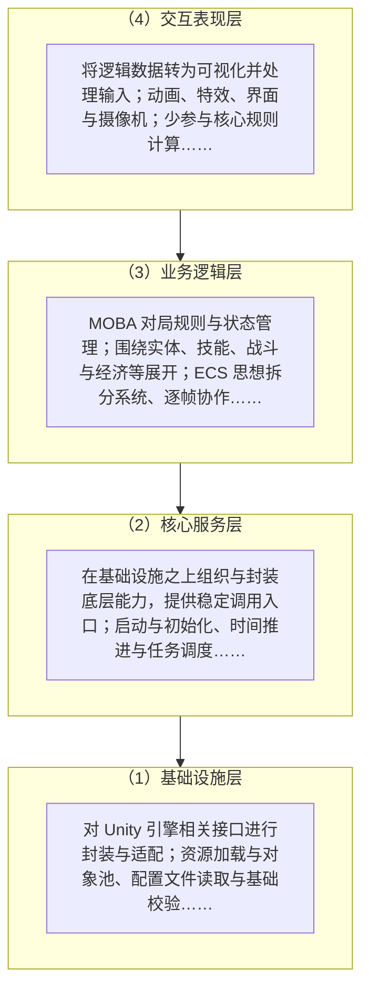

> 说明：图中自上而下为 **交互表现 → 业务逻辑 → 核心服务 → 基础设施**；箭头表示**依赖方向**（上层依赖下层）。

## 各层要点（节选）

### （1）基础设施层

作为系统最底层，主要负责对 Unity 引擎相关接口进行封装与适配，减少上层对具体 API 的直接依赖；并承担资源加载与对象池、配置读取与基础校验、日志与协程调度等通用能力……

在设计上尽量避免具体游戏语义，便于复用与替换实现……

### （2）核心服务层

位于基础设施之上，对底层能力进行组织与封装，对外提供相对稳定入口；不直接承载具体游戏规则，而统一管理时间推进、任务调度及全局状态初始化等……

通过统一启动与初始化协调子系统节拍；数据读写经本层集中转接；网络与扩展以接口抽象……

### （3）业务逻辑层

系统核心，负责 MOBA 对局规则与状态管理；围绕实体、技能、战斗与经济等，由多模块驱动对局……

结合 ECS 拆分为独立系统并按序每帧执行（生成、状态、伤害、Buff、AI 等）；目标选择、技能执行与效果应用等形成完整链条……

### （4）交互表现层

将逻辑层数据转为可视化并处理用户输入；含角色动画、特效、界面与摄像机等……

尽量避免直接参与核心规则计算；界面与对象绑定以反映状态；输入转为逻辑层可识别指令……

---

## 游戏事件总线与调度

本工程中的**游戏逻辑事件总线**主要位于命名空间 `Basement.Events`：以 `GameEventBus` 为中心完成订阅与广播；`GameEventScheduler` 负责带优先级的入队与按帧出队，再转发到总线。**Unity 场景内的 `EventDispatcher`**（`Basement.Events.Unity`）用于在 MonoBehaviour 生命周期内初始化总线/调度器，并在非 ECS 泵送模式下每帧推进调度器。

> **与 Unity UGUI 的区分**：`UnityEngine.EventSystems.EventSystem` 负责画布射线检测、拖拽等 **UI 输入基础设施**，与上述游戏事件总线职责不同；本工程中部分 UI 控件（例如 HUD）会引用前者，但**跨模块的业务通知**（如购买成功、单位阵亡等）应走 `IGameEvent` + `GameEventBus`。

### 架构与数据流

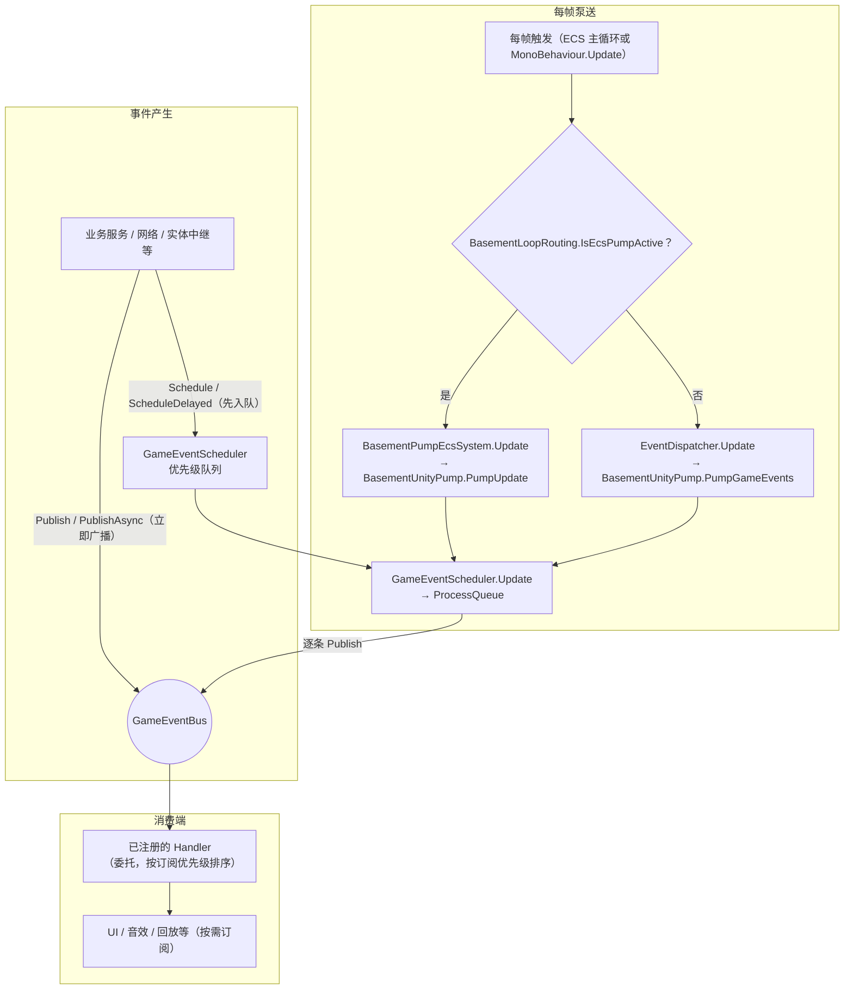

### 核心组件与职责（十条）

口语中的「EventSystem」常混指 **`UnityEngine.EventSystems.EventSystem`**（UGUI 输入）与 **`GameEventBus` 管线**。下表仅保留 **10 条**与「订阅—调度—泵送—发布」直接相关的说明；路径相对于 `Assets/_Project/Code/Scripts`。

| # | 组件（命名空间 / 路径提示） | 关键 API 或成员 | 在系统中的作用 |
|---|----------------------------|-----------------|----------------|
| 1 | `GameEventBus`（`Basement/Events/GameEventBus.cs`） | `Subscribe<T>`、`Unsubscribe<T>`、`Publish<T>`、`PublishAsync<T>`、`Clear` | 全局事件总线：按事件类型登记处理器并同步/异步广播。 |
| 2 | `IGameEvent`（`Basement/Events/IGameEvent.cs`） | `EventId`、`Timestamp`、`Priority` | 业务事件数据契约；`GameEventPriority` 供调度与订阅排序使用。 |
| 3 | `GameEventHandlerDelegate<T>`、`GameEventSubscriptionOptions`（`IGameEventHandler.cs`） | `Priority`、`IsAsync`、`Filter` | 处理器形态及订阅策略（优先级、异步、过滤）。 |
| 4 | `GameEventScheduler`（`Basement/Events/GameEventScheduler.cs`） | `Schedule`、`ScheduleDelayed`、`Update`、`ProcessQueue`、`QueueSize` | 优先级队列：先入队、按帧节流出队，再调用 `GameEventBus.Publish`。 |
| 5 | `EventDispatcher`（`Basement/Events/Unity/EventDispatcher.cs`） | `Awake`、`Update`、`OnDestroy`、`GetOrCreate` | 场景内 **MonoBehaviour** 入口：初始化总线/调度器；非 ECS 模式下每帧泵送游戏事件。 |
| 6 | `BasementUnityPump`（`Basement/Runtime/BasementUnityPump.cs`） | `PumpGameEvents`、`PumpUpdate` | 把对局时间、定时任务与游戏事件调度的推进集中在一处调用。 |
| 7 | `BasementPumpEcsSystem`、`BasementLoopRouting`（`Basement/Runtime/`） | `Update`（内调 `PumpUpdate`）、`IsEcsPumpActive` | **ECS 主循环泵送**；与 `EventDispatcher` 二选一，避免同一帧重复推进。 |
| 8 | `BasementRuntimeBootstrap`（`Basement/Runtime/BasementRuntimeBootstrap.cs`） | `AfterSceneLoad` | 可选：在启用配置时向 `EcsWorld` 注册泵送并初始化 Basement 单例。 |
| 9 | `EventDeduplicator`、`BatchEventProcessor`、`EventPool<T>`、`GameEventHistory`（`Basement/Events/`） | `ShouldProcessEvent`、`AddEvent`/`ForceProcess`、`Get`/`Return`、`RecordEvent` 等 | **可选增强**：去重、批处理转 Publish、事件对象池、历史（须在业务路径自行接入）。 |
| 10 | 典型 `IGameEvent`（`Gameplay/`、`Network/`） | `ShopGameplayEvents`、`CombatUnitDiedGameEvent`、`NetworkSessionEvents` 等 | **业务发布示例**：跨模块通知走总线；与 UGUI `EventSystem` 职责不同。 |

编辑器下另有 `EventDebugWindow`（**Tools/Event Debug**）用于查看队列与清空订阅，篇幅所限不单列。

---

## 配置模块：边界与职责分层

以下对照工程实现（`Assets/_Project/Code/Scripts/Basement/Configuration/`）：业务侧通过 **`ConfigurationManager` 强类型 API** 取数；**`IConfiguration`** 统一描述元数据与校验；**`IConfigurationParser`**（如 `JsonConfigurationParser`）隔离文件格式与 IO；数据文件默认落在 **`StreamingAssets/Config`**。静态工具 **`ConfigurationValidator`** 仅对 `IConfiguration` 做封装调用。

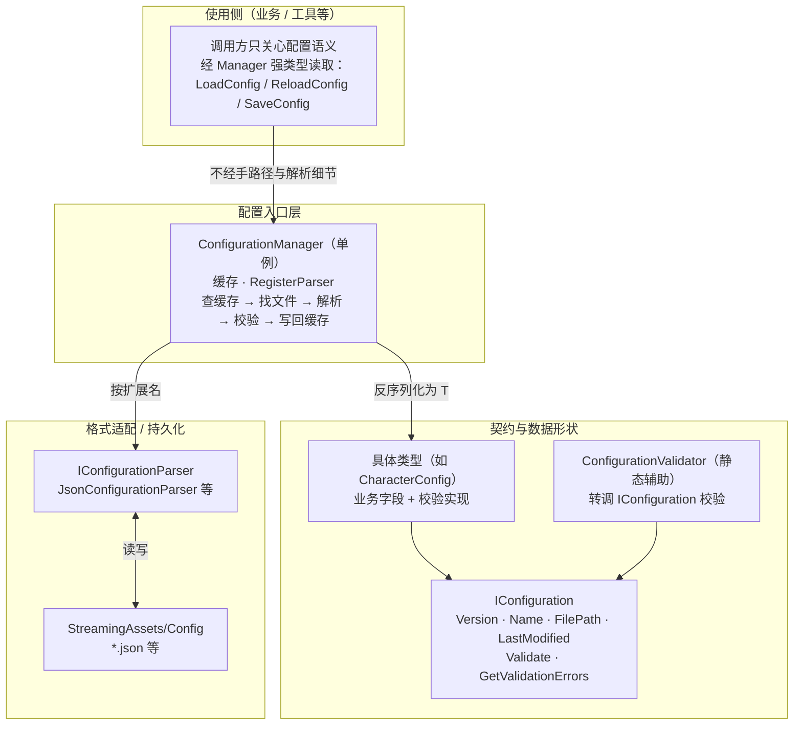

> **边界含义**：上层不直接拼路径读 JSON；**存储形态与解析策略**集中在 Manager + Parser + 文件层；**合法性**在 Load 路径上通过 `Validate` / `GetValidationErrors` 前置，失败则拒绝进入缓存（与 `ConfigurationManager.LoadConfig` 行为一致）。

---

## 4.4.1 资源池与对象复用 — 性能对比呈现

下图为 **Profiler 常见观察维度** 的展示：左栏为 **CPU 帧时间** 在 60s 对局片段内随时间变化（青色：**对象池/复用路径**；橙色：**运行时频繁 Instantiate + Destroy**）；右栏为同一片段内的 **平均帧时间** 与 **GC.Alloc（KB/帧）** 分组对比，视觉风格参考 Unity Profiler 暗色主题。

**读图要点（可与 Editor 中 CPU Usage / GC Alloc 模块对照）：**

- **帧时间曲线**：复用路径下曲线更贴近平稳带区，尖峰更少；频繁创建销毁路径易出现与分配/回收相关的阶段性抬升。
- **条形汇总**：平均 CPU frame 与每帧 GC 分配在两种策略下通常呈现可分辨的量级差异，后者更直接体现在 **GC.Alloc** 栏目（与 Profiler 的 *GC.Alloc* 列含义一致）。

实现侧对应模块：`ResourcePoolManager`、`GameObjectPool`、`GenericResourcePool`、`ResourceLoader` 及行为约束 `IReusable`（`OnSpawn` / `OnDespawn`）所形成的「获取—使用—回收」闭环。

---

## 4.5 协程、线程与时序任务调度

### 4.5.a 分层示意图（时间语义与执行域）

下图自上而下对应：**上层玩法时间需求** → **统一时序调度与引擎节拍** → **协程与线程池封装** → **主线程安全边界**（与正文 4.5 / 4.5.1 / 4.5.2 表述一致）。其中 `TimingTaskScheduler` 等由 `BasementUnityPump` 或 `TaskDispatcher` 对接至 Unity 更新节拍，详见工程 `Basement/Runtime/` 与 `Basement/TimingTask/`。

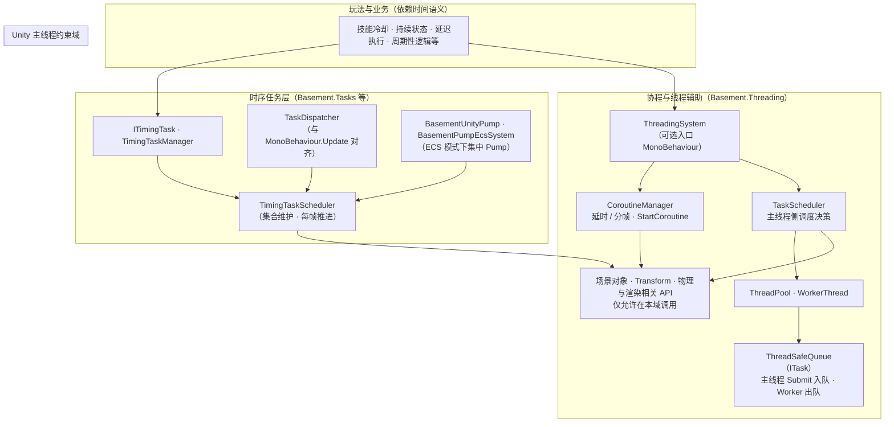

> **读图**：**时序任务**与**协程/线程**并行收纳「时间相关」能力：前者与帧节拍、任务抽象对齐；后者区分 **主线程**（调度与引擎交互）与 **工作线程**（`ITask.Execute` 内禁止触碰 UnityEngine API，结果由主线程侧继续处理）。

### 4.5.b 线程泳道图（主线程与工作线程交互）

下列 **序列图** 泳道化展示 `TaskScheduler`（在 **主线程** `Update` 中）向 `ThreadPool` 投递、`ThreadSafeQueue` 缓冲、**工作线程**执行 `ActionTask.Execute` 的常见路径；主线程通过 `ProcessRunningTasks` 等逻辑观测任务终态并做 Unity 安全侧收尾（具体完成回调策略以实现为准）。协程路径仍在主线程内由 `CoroutineManager` 驱动，不经过工作线程。

```mermaid
sequenceDiagram
  autonumber
  participant U as 主线程 Unity
  participant TS as TaskScheduler
  participant TP as ThreadPool
  participant Q as ThreadSafeQueue
  participant W as WorkerThread

  rect rgb(40, 44, 52)
    Note over U,W: 提交阶段（主线程）
    U->>TS: SubmitTask(ITask)
    U->>TS: Update()
    TS->>TS: ProcessReadyTasks
    TS->>TP: SubmitTask(task)
    TP->>Q: Enqueue(task)
  end

  rect rgb(35, 48, 58)
    Note over U,W: 执行阶段（工作线程 · 禁止 UnityEngine API）
    W->>Q: Dequeue / 等待任务
    Q-->>W: ITask
    W->>W: task.Execute()
  end

  rect rgb(40, 44, 52)
    Note over U,W: 汇合阶段（主线程轮询终态）
    U->>TS: Update()
    TS->>TS: ProcessRunningTasks
    Note over U: Completed / Failed / Canceled 后仅在此进行与场景对象相关的后续处理
  end
```

**与协程的对比（仍属主线程）**：`CoroutineManager.StartCoroutine` 始终在 **主线程** 上分片执行；上图 **W** 泳道仅对应 `ThreadPool` 内 `WorkerThread` 对 `ITask` 的消费路径。

---

## 4.6.1 场景加载与引导脚本 — 阶段 / 时间线（泳道）

场景加载完成后，Unity 在**主线程**上推进生命周期：先有宿主与 `EcsWorld` 等 **Awake**，再进入 **`RuntimeInitializeOnLoadMethod(RuntimeInitializeLoadType.AfterSceneLoad)`** 回调批次。本工程中 **`BasementRuntimeBootstrap`** 与 **`GameplaySystemsBootstrap`** 均挂在此钩子下：前者维持 Basement 运行环境并向 `EcsWorld` 注册 **`BasementPumpEcsSystem`（`UpdateOrder = 0`，内调 `BasementUnityPump.PumpUpdate`）**；后者负责局内 **`IEcsSystem`** 组装。两个静态引导之间 **不应对回调先后顺序作硬假设**（Unity 对多个 `AfterSceneLoad` 的调用顺序未对业务层保证），仅要求均以 **`EcsWorld.Instance` 已就绪** 为前提。

```mermaid
sequenceDiagram
  autonumber
  participant U as Unity 主线程
  participant EW as EcsWorld
  box Basement 引导泳道
    participant BR as BasementRuntimeBootstrap
  end
  box Gameplay 引导泳道
    participant GP as GameplaySystemsBootstrap
  end

  rect rgb(42, 45, 52)
    Note over U,EW: 阶段 ① 场景与宿主初始化
    U->>EW: 场景加载完成 → 宿主 Awake  （实体管理预热等，早于 AfterSceneLoad 批次）
  end

  rect rgb(42, 48, 58)
    Note over U,GP: 阶段 ② AfterSceneLoad（配置开启 Basement ECS 泵送时）
    par 职责并列（同属一批回调；彼此先后以运行时为准）
      U->>BR: AfterSceneLoad
      BR->>BR: TimingTaskManager / TimingTaskScheduler  GameEventBus / GameEventScheduler  MatchTimeService.BeginMatch（仅当 UseEcsWorldBasementLoop）
      BR->>EW: AddEcsSystem(BasementPumpEcsSystem)
      BR->>BR: BasementLoopRouting.MarkEcsPumpActive
    and
      U->>GP: AfterSceneLoad
      GP->>GP: BuffManager.EnableEcsDriving  SkillConditionRegistry…
      GP->>EW: TryAdd 各 IEcsSystem  （如 EntitySpawn、Tower、Impact、Vitality、BuffTick、Jungle、Minion、SkillCastPipeline）
    end
  end

  rect rgb(42, 45, 52)
    Note over U,EW: 阶段 ③ 进入运行帧（Update）
    U->>EW: Update 循环按起始 UpdateOrder 调度 IEcsSystem
    Note over EW: BasementPumpEcsSystem 优先泵送 BasementUnityPump  （MatchTime · TimingTask · GameEvent…）
  end
```

**读图说明**：

- **阶段 ②** 中 `par`/`and` 表示**两条引导职责分离**；若未启用 `BasementRuntimeOptions.UseEcsWorldBasementLoop`，`BasementRuntimeBootstrap` 将早退，泵送可改由场景中 **`TaskDispatcher` / `EventDispatcher`** 等 MonoBehaviour 承担（与正文 4.5、4.6 叙述一致时可加脚注说明）。
- **阶段 ③** 中各 Gameplay 系统的**帧内相对顺序**由各自 **`UpdateOrder`** 与 `EcsWorld` 插入规则保证，而非仅靠「注册先后」。

---

## 5.1 ECS 世界与系统注册 — 关键类型与 API（≤10 条）

路径均相对于 `Assets/_Project/Code/Scripts`。下表对应正文 **5.1 / 5.1.1 / 5.1.2**：**运行机制器 → 契约 → 表预热与引导注册**。

| 脚本 / 类型 | 关键 API 或成员 | 功能 |
| ----------- | ----------------- | ------ |
| `Core/Patterns/ECS/EcsWorld.cs` → `EcsWorld` | `AddEcsSystem`、`RemoveEcsSystem`、`GetEcsSystem<T>`、`Update`、`FixedUpdate`、`OnDestroy`、`EcsManager`、`CombatImpacts` | 局内 ECS **运行容器**：按 `UpdateOrder` **有序插入**并每帧依次 `Update`；销毁时统一 `Destroy`；对外暴露实体管理器与 Impact 入口。 |
| `Core/Patterns/ECS/EcsWorld.cs` → `EcsWorld`（封装 API） | `CreateEntity`、`DestroyEntity`、`GetComponent<T>`、`AddComponent`、`SetComponent`、`HasComponent`、`RemoveComponent`、`GetEntitiesWithComponent<T>` | **实体—组件**读写与查询的统一入口，业务系统主要经由 World 访问数据而非散落逻辑。 |
| `Core/Patterns/ECS/EcsWorld.cs` | `Initialize`（`Awake` 调用）、`WarmStreamingGameTablesEarly`、`TryReloadSkillCatalogFromStreaming` | 宿主就绪时 **表预热**：拉起 `JsonManager`、`BuffDataLoader` 等，并从 StreamingAssets 灌入 **`SkillCatalog`**，为后续系统提供数据底稿。 |
| `Core/Patterns/ECS/EcsWorld.cs` → `EcsWorldInitializer` | `[RuntimeInitializeOnLoad(BeforeSceneLoad)]` `AutoCreateEcsWorld` | **进程早期**访问 `EcsWorld.Instance`，配合场景加载前完成单例宿主预热（正文所述 BeforeSceneLoad 阶段）。 |
| `Core/Patterns/ECS/EcsEntityManager.cs`（由 World 持有） | `CreateEntity`、`DestroyEntity`、组件槽 `Get`/`Set`/`Has`/`Remove` 等（经 World 转发） | **实体生命周期与组件存储** 的实际维护者；系统逻辑基于组件数据而非场景对象挂载顺序。 |
| `Core/Patterns/ECS/IEcsSystem.cs` | `UpdateOrder`、`Initialize`、`Update`、`Destroy` | **系统契约**：声明帧内阶段并在 `AddEcsSystem` 时自动 `Initialize`；`UpdateOrder` 越小越早执行。 |
| `Core/Patterns/ECS/IEcsComponent.cs` | `InitializeDefaults` | **组件数据契约**（工程中为 `struct` 组件与接口组合使用），便于统一初始化约定。 |
| `Gameplay/Runtime/GameplaySystemsBootstrap.cs` | `AfterSceneLoad`、`TryAdd<T>(world, factory)` | **局内系统集中注册**：`TryAdd` 先 `GetEcsSystem<T>() == null` 再 `AddEcsSystem`，避免重复加载导致**同一逻辑多实例**。 |
| `Gameplay/Runtime/GameplaySystemsBootstrap.cs` | `BuffManager.EnableEcsDriving`、`SkillConditionRegistry.RegisterBuiltInDefaults` | 注册系统前的 **模式与数据准备**：Buff 走 ECS 驱动；技能管线所需 **条件注册表** 预置。 |
| `Basement/Runtime/BasementPumpEcsSystem.cs` | `UpdateOrder`、`Update` → `BasementUnityPump.PumpUpdate` | （与 `EcsWorld` 搭配）在 **帧更新链最前** 泵送 MatchTime / TimingTask / GameEvent 等 Basement 节拍，与 Gameplay 系统形成同一条 `Update` 调度链。 |

---

## `CombatBoardLiteComponent` 成员与功能

定义位置：`Gameplay/Entity/CombatBoardLiteComponent.cs`（命名空间 `Core.Entity`）。**战斗期轻量黑板**：仅存 **逻辑实体 Id**（`long`，**`0` 表示无效**），**不**存放 `UnityEngine.Object`；实现 `IEcsComponent`，与塔 `Strike`、Impact 链、`UnitVitalitySystem` 等协作（详见《MOBA局内单位模块ECS设计文档》§8）。

| 成员 | 功能 |
| ----- | ------ |
| `AttackTargetEntityId` | **主攻/瞄准对象**：当前普攻或单体技能锁定的目标；索敌、玩家选敌、`TowerCombatCycle` 与 Impact 出站对齐时读写；多目标 / AoE 以施法上下文为主。 |
| `ThreatTargetEntityId` | **仇恨首要对象**（单槽简易实现）；可与主攻相同，也可在嘲讽、塔仇恨等规则下与 `AttackTargetEntityId` 分离。 |
| `LastDamageFromEntityId` | **最近一次对自身的有效伤害来源**（进攻方实体 Id）；Impact 等结算路径更新，供击杀链 / 承伤语义使用。 |
| `KillerEntityId` | **击倒时的击杀者**；存活阶段为 `0`，由 `UnitVitalitySystem`（或等价逻辑）在死亡时写入。 |
| `AssistEntityId0` / `AssistEntityId1` / `AssistEntityId2` | **助攻候选人**（毕设至多三槽）；无效为 `0`，经济或统计按需填写。 |
| `InitializeDefaults()` | `IEcsComponent` 约定：将全部 Id 置 `0`，黑板恢复为可复用的初始态。 |

**写入方/读取方（工程侧常见分工）**：塔与 AI 索敌写 `AttackTargetEntityId`；`ImpactSystem` 可写 `LastDamageFromEntityId`；`UnitVitalitySystem` 写 `KillerEntityId`；普攻/校验侧经 `CombatBoardLiteComponent` 与 `Strike`、Melee 规则对齐，避免并行「第二套当前目标」字段。

---

## 5.3.1 兵线模块设计 — 流程图

实现路径：`Gameplay/Entity/LaneMinion/`、`Gameplay/Entity/Spawn/MinionWaveSpawner.cs`。兵线 **专用状态** 在 `LaneMinionModuleComponent`；**路径点 Transform 数组** 在 `LaneMinionWaypointRuntime`；**数值**（生命、移速等）仍在 `EntityDataComponent`。

### 总览：路径写入 → 波次生成 → ECS 装配

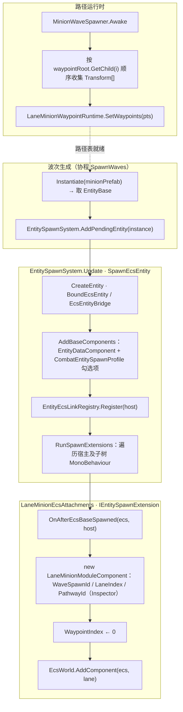

### 每帧推进：LaneMinionMoveSystem（UpdateOrder = 39）

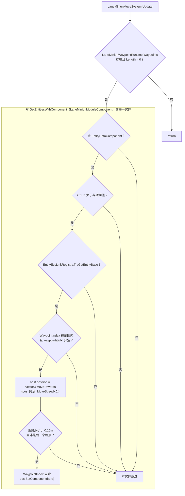

图中 **MoveSpeed** 来自 `EntityDataComponent.GetData(EntityBaseDataCore.MoveSpeed)`；**CrtHp** 与 `LaneMinionMoveSystem` 中 `1e-9` 阈值判定一致。

---

## 5.3.2 刷怪器与节律控制 — MinionWaveSpawner 流程图

局内由 **MonoBehaviour Spawner** 在场景位姿实例化预制体，将 **`EntityBase` 提交至 `EntitySpawnSystem.AddPendingEntity`**；兵线波次由 **`Core.Entity.Spawn.MinionWaveSpawner`** 承担。防御塔、野区等若采用同类做法，亦为 **Spawner + 生成队列** 模式，节律字段各在对应组件的 Inspector 中配置。

脚本路径：`Gameplay/Entity/Spawn/MinionWaveSpawner.cs`。

### 生命周期与协程 SpawnWaves

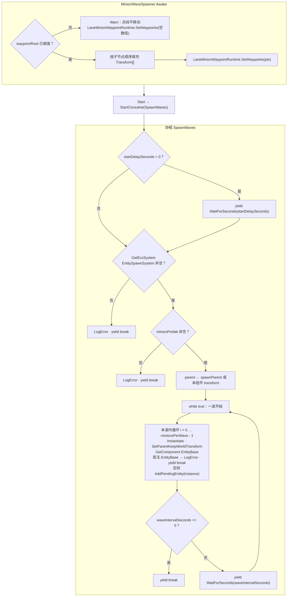

**节律参数（Inspector）**：`startDelaySeconds` 首轮延迟；`minionsPerWave` 每波实例个数；`waveIntervalSeconds` 波间等待。若 **`waveIntervalSeconds ≤ 0`**，当前波生成完毕后 **结束协程**（不再循环）。**`EntitySpawnSystem`** 在后续 **`Update`** 中出队并执行 `SpawnEcsEntity`，与兵线 ECS 装配衔接见 §5.3.1 总览图。

---

## 5.4.1 攻击事件的触发 — Impact 流程图

**设计要点**：普攻、防御塔、技能 / Buff **共用** `ImpactManager.CreateImpactEvent` 进入事件实体，再由 **`ImpactSystem`** 消费；**选敌 → 写黑板 → 出伤校验 → 投递** 分步完成，避免混在单一「攻击函数」里。下文对 **普攻** 展开；塔与技能路径在总览中缩略。

### 总览：多来源汇入同一创建入口

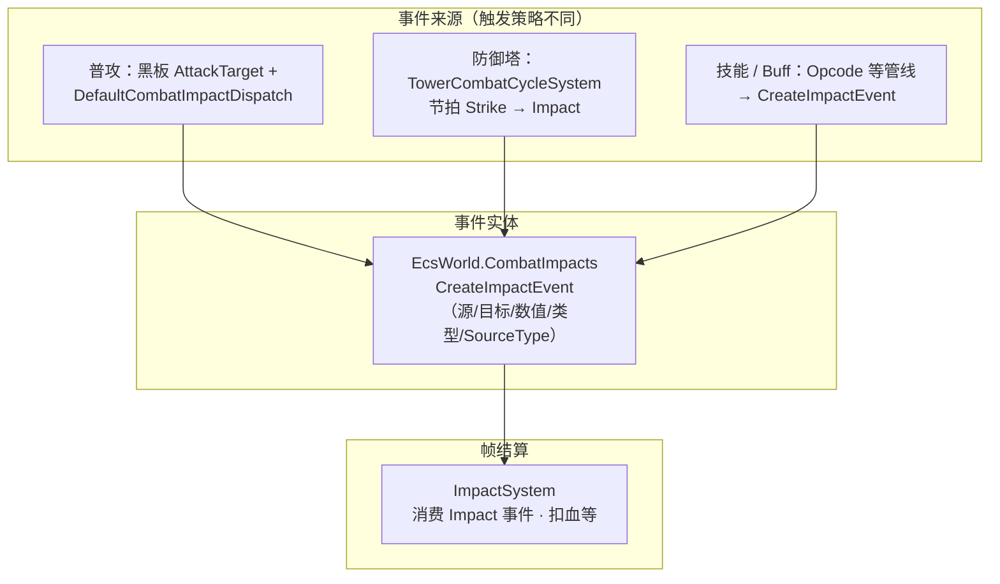

### 普攻短路径（选目标 → 写黑板 → Dispatch）

典型串联：`MvpHeroBasicAttackDebugBridge` / AI 等价、`CombatBoardTargetSync`、`UnitAnimDrv`（可选）、`DefaultCombatImpactDispatch`。接口 **`ICombatImpactDispatch.TryDispatchNormalAttack`** 实现类为 **`DefaultCombatImpactDispatch`**。

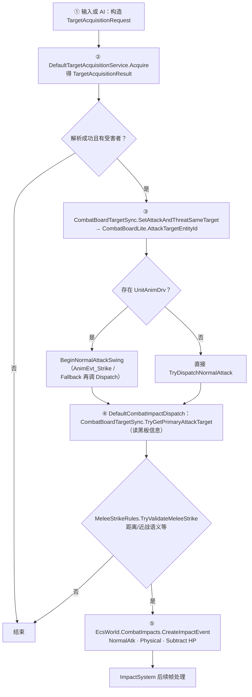

**说明**：`CreateImpactEvent` 在 `ImpactManager` 中创建带 **`ImpactEventComponent` / `ImpactValueComponent`** 的实体；**攻击力** 当前取自攻击者 **`EntityDataComponent` 的 `AtkAD`**（见 `DefaultCombatImpactDispatch` 实现）。塔与 Opcode 分支不展开时，均可视为 **不同前置** 汇合到 **同一 `CreateImpactEvent`**。

---

## 5.4.2 伤害处理链的设计 — ImpactSystem（横置）

事件字段与 **`ImpactEventComponent`** 一致：**Source、Target、TargetAttribute、OperationType、ImpactType、SourceType**（另含 **`ImpactValueComponent.BaseValue`**、运行时 **IsCritical、EventId** 等）。**普攻示例**：多为 **Hp + Subtract + Physical + NormalAtk**；治疗、属性变更、Buff 衍生物伤仅换 **目标属性 / 操作类型 / 伤害类型** 等字段，**仍走同一套 Apply 分支**。

实现主流程见 `Gameplay/Impact/ImpactSystem.cs`（`UpdateOrder = 31`）。下图 **自左向右** 压缩步骤，失败分支（来源目标无效、无 `EntityData`、未命中等）在代码中标记 **IsProcessed** 后销毁事件，图中不单列分叉以控制体量。

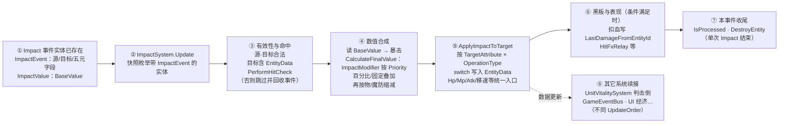

**读图**：**ImpactSystem** 只负责 **一次** 数值与黑板、本地表现触发；**死亡认定、全局事件、界面反馈** 由 **`UnitVitalitySystem`**（及总线等）在后续节拍承接，避免在 Impact 内堆叠全链路分支。

---

## 5.5 效果与技能执行管线

技能将 **表驱动步骤** 编排为短时间内的行为序列：**目标与上下文确认** → **按技能定义推进批次/条件步** → **通过 Buff 施加（含 Opcode）衔接控制、属性与 Impact 伤害**。核心类型：**`SkillCastContext`**（施法者、主副目标、等级、时间戳等）、**`SkillExecutionFacade`**（目录、冷却、启动管线）、**`SkillCastPipelineSystem`**（`UpdateOrder = 50`，会话驱动）。

### 5.5.1 技能执行管线逻辑（横置）

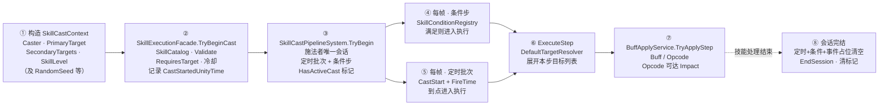

**读图说明**：

- **上下文**仅描述「这一次施法」的事实；**`SkillDefinition.Steps`** 与 **`PipelineScheduleBuilder`** 决定 **定时批次** 与 **条件步**；条件求值走 **`SkillConditionRegistry`**。  
- **`BuffApplyService` / Opcode** 与 §5.4 **Impact** 的关系：伤害类 Opcode 仍可经 **`CreateImpactEvent`** 进入 **`ImpactSystem`**，技能层只做 **编排**。  
- **门面侧**：`TryBeginCast` 成功后在同一调用内 **`SkillCooldownTracker.NotifyCast`**（若尊重 CD），并对宿主 **`UnitAnimDrv.NotifySkillCastStarted`**；**`CancelForCaster`** 将会话标为 **`Cancelled`**。  
- **OnEvent 步骤** 当前为占位（日志警告后清空），图中不单独展开。

### 5.5.2 Buff 与 Opcode 处理系统（横置）

**数据模型**（`BuffOpcodeModel.cs` 等）：**`BuffEffectOpcode`** 标识原子操作类型；**`BuffOpcodeInstruction`** 保存单条 Opcode 及 `ArgF0/ArgI0/…` 参数；**`BuffEffectComposition`** 按 **`OnApply`、 `OnPeriodicTick`、 `OnRemove`** 三类触发点分别挂载指令列表。运行时 **`MetaBuff`**（表驱动宿主）在 **`OnGet`** 执行 **`OnApply`**，在 **`FixedUpdate`**（由 **`BuffManager.PumpBuffPeriodicSteps`** 按固定节拍驱动）执行 **`OnPeriodicTick`**；**`OnRemove`** 已在数据层预留列表，可在 Buff 移除路径统一接 **`BuffOpcodeDispatcher`**（与 **`BuffBase.OnLost`** 等扩展对齐）。

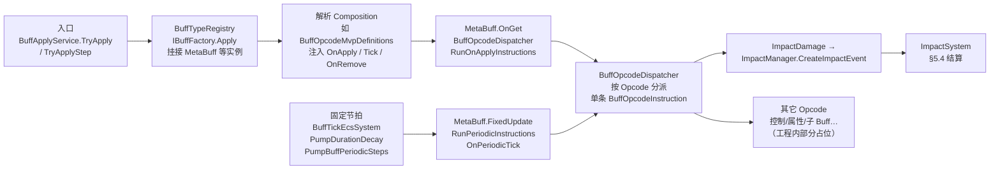

**读图说明**：

- **技能管线**来的施法仅在 **① `TryApplyStep`** 处与 Buff 汇合；之后 **生命周期完全由 Buff 子系统**驱动。  
- **周期伤害**：MVP 中间隔来自 **`BuffOpcodeMvpDefinitions.GetPeriodicIntervalSeconds`**，与 **`MetaBuff`** 内时间戳比较后触发 **`RunPeriodicInstructions`**。  
- **`OnRemove`**：图中未单独画支线；与 **持续时间结束 / 驱散** 等移除逻辑衔接后，可对 **` composition.OnRemove`** 调用与 Apply 相同的 **Dispatcher** 入口，实现移除时清理或最后一次效果。

---

## 5.6 商店、装备与经济数据

装备强度通过 **`ItemConfigDefinition.EquippedBuffs`**（JSON `equippedBuffs[]`）与 **技能** 共用 **`buffId` / `BuffApplyService` / Opcode / Impact** 管线；商店与合成只负责 **决策、扣费、实例与栏位**，效果落点仍归 **Buff 子系统**。

### 5.6.1 购得装备 → Buff → Impact（横置主流程）

实现侧：`Gameplay.Shop`（`ShopAcquisitionService`、`PurchaseService`、`CraftingService`），`Gameplay.Equipment`（`EquipmentBuffApplier`），配置 `ItemConfigDefinition.EquippedBuffs`。

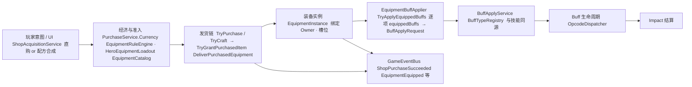

**代码顺序提示**：当前 `DeliverPurchasedEquipment` 在 **写入 `loadout` 栏位前** 调用 **`TryApplyEquippedBuffs`**（失败则整单发货失败并避免占槽）；具体以 `PurchaseService` 为准。

### 5.6.2 配置落点与卸下对称

**配置**：`EquipmentBuffBindingDefinition`（`bindingId`、`buffId` 等）挂在 **`ItemConfigDefinition.EquippedBuffs`**；可选校验 **`BuffDataLoader` / `BuffTypeRegistry`**（见 **`EquipmentEquipOptions`**）。

**卸下 / 出售**：`PurchaseService.TryUnequipSlot`、`EquipmentSellService` 等路径 → **`EquipmentBuffApplier.RemoveEquippedBuffs(instance)`** → 清栏位 → 发布 **`EquipmentUnequippedGameEvent`** 等；与穿戴 **共享同一套 Buff 追踪**，避免「装备效果」与技能 **双真理源**。

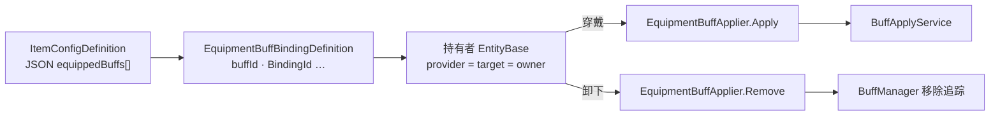
