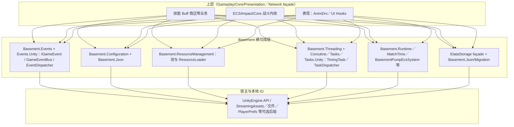
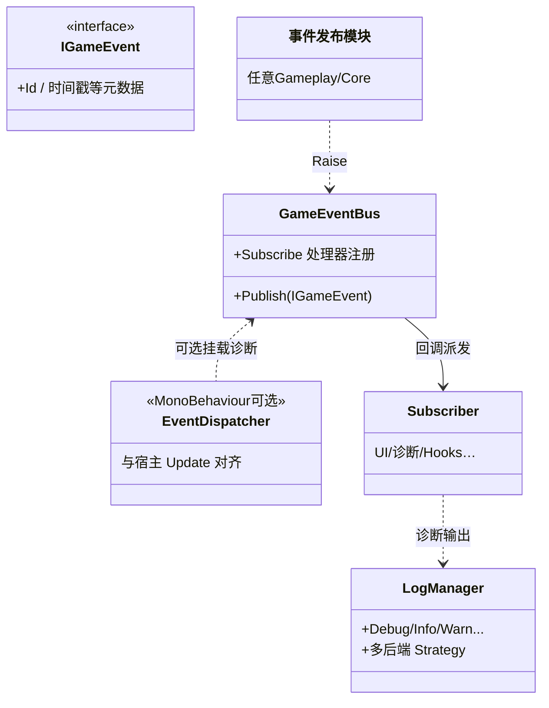
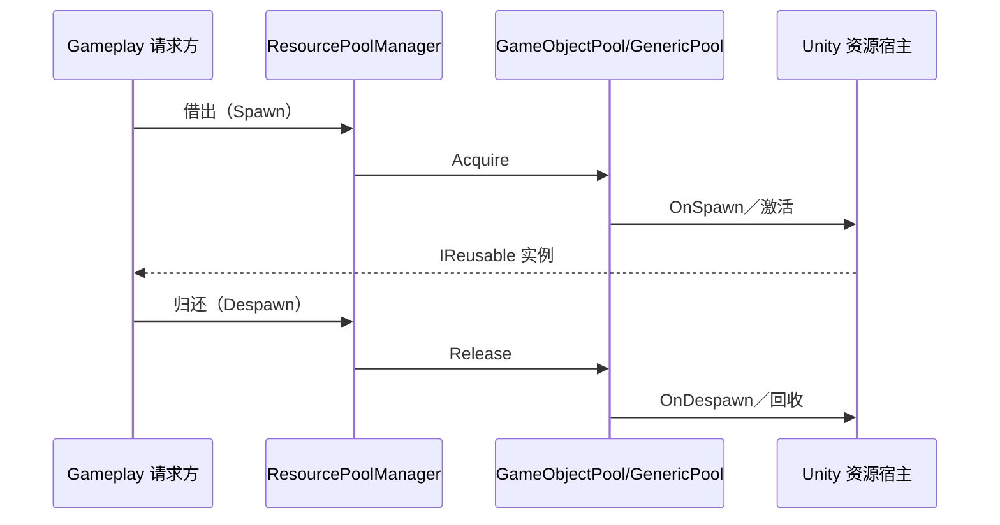
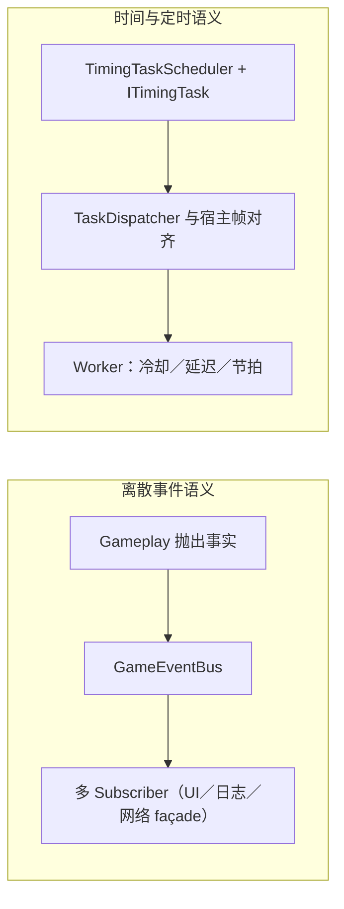
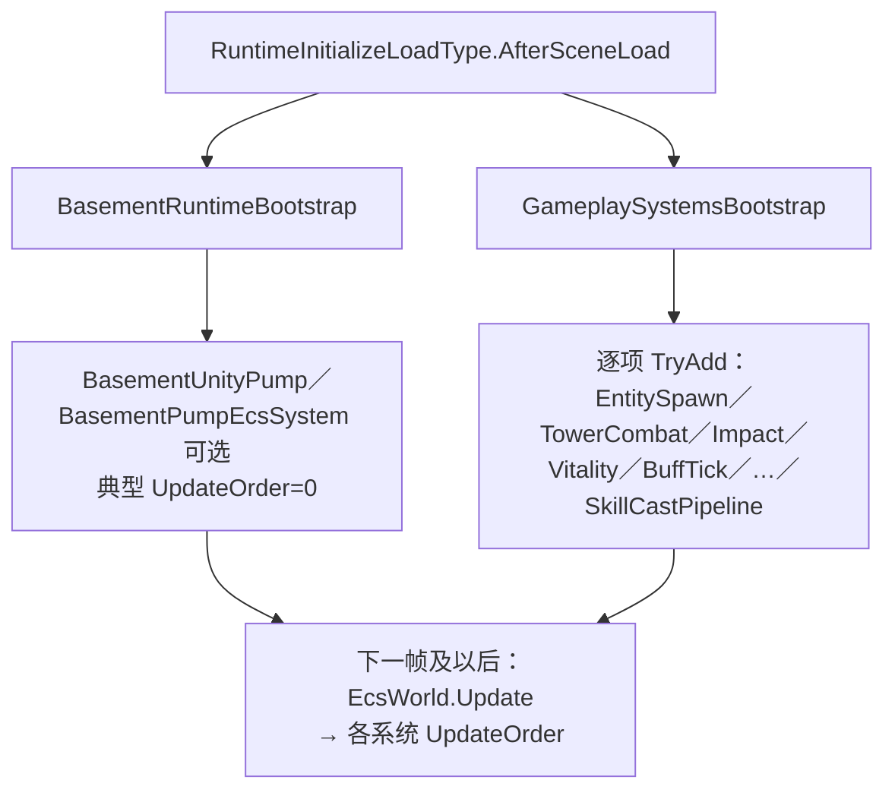
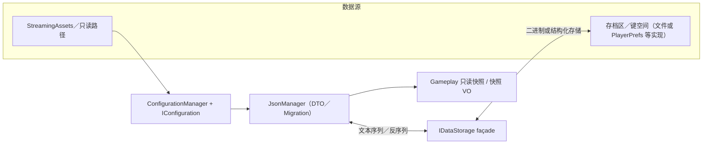

# 第三章 工程基础层

第二章已从需求分析与总体架构角度，明确了系统的四层逻辑划分及各层依赖约束。本章基于该架构约定，对基础设施层与核心横切服务中已形成稳定命名空间边界的核心模块进行详细论述，具体包括事件分发与诊断输出、配置与JSON数据管线、资源池与加载策略、协程/线程与定时任务调度，以及场景加载后的运行时引导与本地化数据链路。上述模块共同构成Gameplay与Core上层逻辑的“运行底座”，其设计严格遵循软件工程中关注点分离、可测试性与可替换性原则，为上层业务逻辑的稳定实现提供可靠支撑。

> 图3-1（建议） Basement横切模块之间的依赖及服务调用方向示意：自上而下为业务域对事件、配置、资源、节拍、持久化等能力的消费，底层模块直接对接Unity引擎与文件系统；定稿时需用矢量图按规范重绘。

**图 3-1（Mermaid 逻辑稿） Basement 对上服务依赖方向**

以下内容与《工程模块与命名空间—现行实现总览》中 `Basement/*` 族命名空间对齐，可在编辑器中预览后导出矢量图置入 Word。

## 3.1 事件分发与调试支撑

事件分发与调试支撑模块的核心目标，是实现模块间解耦通信与开发期可观测性，为系统迭代与问题排查提供保障，具体分为领域事件总线与多级别日志两个核心部分。

### 3.1.1 领域事件总线与接口契约

在复杂客户端系统中，若模块间通过直接引用具体类型实现调用，将快速形成复杂且难以梳理的依赖网络，增加系统维护成本。本项目在Basement层引入以IGameEvent为语义标记的事件接口，配合GameEventBus实现发布—订阅式通信机制：事件类型携带唯一标识、时间戳与优先级等元信息，订阅方通过泛型处理器接口注册感兴趣的事件族，在编译边界上实现“事件触发”与“事件响应”的解耦，避免模块间直接耦合。

相较于传统静态回调注册方式，统一事件总线具有显著工程价值：一是可追溯性，同一领域事件可被诊断模块、表现层钩子等多方订阅，且无需修改事件发布方源代码；二是具备节流与队列化能力，调度层可在总线后端引入优先级队列、异步派发或简要历史记录策略，降低峰值帧内同步递归调用的风险；三是扩展性强，新增玩法逻辑可通过新增事件载荷类型或订阅者实现，无需在中间层堆砌条件分支进行聚合。该设计与观察者模式的核心思想一致，将传统UI-MVC架构中的狭义观察者场景，扩展至系统内任意脚本边界的通信场景。

Unity侧的EventDispatcher等组件与MonoBehaviour生命周期的对齐，由Basement.Events.Unity命名空间承接，便于在编辑器内挂接可视化调试面板，实现开发期事件出入的实时观测。该接线方式仅作为事件交付通道之一，不改变领域事件本身的语义层级，确保事件总线的通用性。

### 3.1.2 多级别日志与诊断输出

与事件总线的“业务流程级”通信功能相并列，日志子系统主要面向开发与运维期的诊断需求，为问题定位与系统优化提供支撑。LogManager作为日志管理的中心化入口，聚合Debug、Info、Warning、Error、Fatal等多级日志输出，可根据配置将日志分发至编辑器控制台、滚动日志文件或与游戏视图叠加的调试窗口。采用策略模式设计的输出后端，可在实验室场景下快速切换最小噪声模式与全量跟踪模式，适配不同调试需求。

从系统质量属性角度来看，结构化日志可携带关键ID、相位标签等上下文片段，在教学与毕业设计场景中，能够有效缩短“现象复现—原因定位—补丁验证”的全流程周期；同时，对高频执行路径的日志输出进行分级门控，可避免正式构建中因无谓字符串拼接导致的性能抖动。与总体架构分层要求一致，玩法脚本仅依赖稳定的日志façade接口，不直接调用UnityEngine.Debug相关方法，确保日志模块与业务层的解耦。

综上，事件分发与日志系统形成双轨支撑机制：事件总线服务于运行期业务流程解耦，提升系统灵活性；日志子系统服务于系统可验证性与可观测性，降低开发与调试成本，二者共同保障上层模块的工程实现质量。

**图 3-2　领域事件与 Unity 宿主调试通道（UML 概要类图／Mermaid）**

## 3.2 配置管理与JSON数据管线

配置管理与JSON数据管线模块，核心是实现系统数值与规则的外置化、可配置，支撑数据驱动开发，**便于在表或 JSON 里改规则、做多组配置对照，也方便做平衡性测试**，具体分为配置抽象与校验、JSON序列化选型、与资源管线协同三个部分。

### 3.2.1 配置抽象与校验

MOBA类项目的数值与规则具有高度碎片化特点，若将相关参数硬编码于C#常量区，**改数值只能改代码**，也不方便**用多份表做对照实验和回归测试**。本项目以IConfiguration族接口为核心，定义“可版本化、可校验”的配置单元，每个配置单元包含版本号、名称、物理路径与最后修改时间等元信息，并提供Validate、GetValidationErrors等自省操作，确保配置数据的合法性。ConfigurationManager负责配置的加载、缓存与热更新策略统筹，为业务域提供强类型访问器，实现业务逻辑与文件IO细节的解耦，使业务层无需关注配置的加载与存储过程。

### 3.2.2 JSON序列化与工程选型

在数据交换格式选型上，JSON具有人类可读、与版本控制系统差异对比友好等优势，适合作为本项目的核心配置交换格式。工程中通过JsonManager及相关迁移注册表，将Newtonsoft.Json等成熟组件集成至Basement数据管线，实现强类型DTO（数据传输对象）与磁盘文本之间的双向映射，并对异常输入采取可诊断的失败处理路径，提升数据解析的稳定性。与仅在Inspector序列化场景使用Unity资源的方案相比，该实现路径更便于在版本仓库外编辑配置文件并提交合并请求，符合课程所强调的数据驱动与配置外置实践要求。

### 3.2.3 与资源路径及内容管线的协同

配置文件通常部署于StreamingAssets或同类只读内容区，其读取路径与平台差异处理，与本章后续所述的资源加载策略存在交叉。Basement层对配置文件的“读取位置、变更判定方式”进行统一封装，避免Gameplay层直接拼接平台相关路径，降低平台适配成本。由此，配置模块不仅承担数据解析职责，还参与运行环境抽象，进一步提升系统的可移植性。

## 3.3 资源管理与加载策略

资源管理与加载策略模块的核心目标，是优化资源使用效率，降低内存占用与GC（垃圾回收）压力，保障系统运行流畅性，具体分为资源池化复用与加载路径设计两个部分。

### 3.3.1 资源池与对象复用

实战型游戏客户端在单位生成、弹幕渲染、特效播放等场景中，易出现频繁的托管对象分配与瞬时GC峰值，影响系统运行流畅度。本项目通过ResourcePoolManager、GameObjectPool、GenericResourcePool、ResourceLoader等组件，以“池化—借出—归还”的生命周期管理模式，封装Unity侧的预制体与子资源。IReusable语义定义了对象复用的标准接口，在对象借出时触发OnSpawn方法、归还时触发OnDespawn方法，确保池中对象的外在状态可被重置，满足重复使用需求。

该设计与软件工程中对象池模式的经典动机一致，通过对象重复使用，降低内存分配器压力，收敛帧时间方差；对于毕业设计体量而言，资源池同时为“小规模性能对比实验”提供了可观测的切入点，例如在同一刷怪压力下，可对比资源池化前后的系统性能采样曲线，验证优化效果。

### 3.3.2 同步与异步加载路径

针对不同场景的带宽与时限需求，资源加载侧设计了同步直达与异步协程驱动两种加载分支。异步加载路径与3.4节所述的协程管理模块协同工作，核心目的是避免重型IO与资源解码操作长时间占据主线程关键段，降低偶发卡顿对用户操作节奏的干扰。Basement层在此处再次扮演底层引擎API的façade角色，向Gameplay层暴露统一的请求式接口，屏蔽加载实现细节，确保业务层逻辑的简洁性。

#### 图 3-5　资源池化借出／归还与控制流概要

## 3.4 协程、线程与时间任务调度

协程、线程与时间任务调度模块，核心是实现系统时间语义的集中管理与异步操作的有序执行，避免分散式时间管理导致的耦合问题，具体分为协程与线程辅助、定时任务调度两个部分。

### 3.4.1 CoroutineManager 与线程辅助

Unity的执行模型以主线程为主导，但在部分场景中，需使用后台线程完成与渲染解耦的计算或IO等待操作，以提升系统效率。CoroutineManager与Basement.Threading命名空间下的任务调度、线程池封装组件，共同提供与引擎主循环显式交接的通道：主线程负责Transform变更、物理计算与渲染等核心操作，工作线程在受控边界内处理可并行的数据准备工作；跨线程数据回投需通过既定队列或Unity主线程调度API完成，避免数据竞争，保障系统稳定性。

### 3.4.2 TimingTaskScheduler 与 TaskDispatcher

玩法层存在大量时间相关语义，如“延迟若干秒执行”“每固定间隔触发”“条件满足后一次性执行”等，若在各处分散维护Time.time比较逻辑，将产生隐式全局耦合，增加系统维护成本。TimingTaskScheduler以ITimingTask为核心抽象，统一表达任务标识、状态、优先级与延迟参数，调度器在Update或独立泵送节拍上推进活跃任务集合，并支持任务取消、批处理与池化等工程化增强功能。TaskDispatcher承担与Unity执行时机绑定的派发职责，使Basement层的定时语义与Gameplay层中基于Time.time的技能管线等模块，可在同一文档中清晰界定各自边界，避免语义混淆。

从架构视角来看，本节所述的定时任务调度与3.1节的离散事件分发形成互补：事件偏重于偶发的业务事实广播，定时任务偏重于时间轴上的承诺执行；二者均不包含具体MOBA业务词汇，保持Basement层的通用性，确保其可复用性与可替换性。

#### 图 3-6　离散事件与时间任务双通道示意

## 3.5 运行时引导与本地化数据链路

运行时引导与本地化数据链路模块，核心是保障系统运行时的正确初始化与数据持久化，支撑系统生命周期管理与跨会话数据保留，具体分为场景加载引导、对局时间管理、数据存储服务三个部分。

### 3.5.1 AfterSceneLoad 引导与泵送职责

Unity场景加载完成后，需在单帧或数帧内完成跨子系统的注册与握手操作，确保系统正常运行，例如Basement环路启动、Gameplay侧GameplaySystemsBootstrap在AfterSceneLoad事件上注册ECS系统等。根据《工程模块与命名空间—现行实现总览》对Basement层的定位，BasementRuntimeBootstrap、BasementUnityPump以及可选的BasementPumpEcsSystem，与Gameplay引导脚本在职责上明确分工：前者负责保障Basement自身的泵送与场景期生命周期管理，后者专注于局内IEcsSystem的装配顺序与UpdateOrder语义控制。论文需强调，多个AfterSceneLoad回调之间的源码执行顺序不由引擎约定，因此子系统初始化的真正先后顺序，需通过UpdateOrder或显式阶段状态约束，而非依赖偶然的注册次序，确保初始化逻辑的稳定性。

### 3.5.2 对局时间与 Unity 时间驱动

Basement.MatchTime等模块提供与对局阶段相关的逻辑时钟视图，使规则层可与Time.timeScale等引擎时间行为对齐，便于实现暂停、调速调试或未来回放教学等功能的接入。将逻辑时钟从零散的Time.time比较中提取出来，形成统一的时间管理接口，有利于单元测试中对未来时间API进行替换或桩实现，提升系统的可测试性。

#### 图 3-3　AfterSceneLoad 引导与 Basement／Gameplay Runtime 分工示意

下文强调：`AfterSceneLoad` 钩子**多个注册点之间执行顺序未定**；一局内 ECS 先后顺序以 **`IEcsSystem.UpdateOrder`** 为准。

### 3.5.3 数据存储服务与 JSON 管线协同

对局摘要、用户偏好、实验检查点等需跨会话保留的数据，通过IDataStorage族接口进行抽象，定义Save、Load、Exists及异步变体等核心操作；实现层可组合文件存储、PlayerPrefs或可插拔的数据库后端，适配不同存储需求。该模块与3.2节JSON数据管线的协同关系可概括为：JSON负责数据的结构化交换与版本差异的可读性，存储服务侧负责键空间管理、数据缓存、可选加密压缩等策略；二者在Basement层实现无缝衔接，使Gameplay层可从“领域快照”粒度思考数据持久化，无需关注底层存储细节。

**图 3-4　JSON 管线与配置／持久化 façade 之间的分工**

表 3-1 Basement 主要横切构件与职责对照（节选）

| 构件/命名空间族 | 主要职责 | 对上层提供的典型价值 |
|:---|:---|:---|
| Basement.Events、Events.Unity | 领域事件总线、Unity 侧派发与调试 | 业务流程解耦、可订阅的诊断链 |
| Basement.Logging | 多级别日志与多后端输出 | 可验证性、开发期可观测性 |
| Basement.Configuration | 配置加载、校验与缓存 | 数据驱动的数值与规则 |
| Basement.Json | JSON 序列化与迁移钩子 | DTO 与磁盘文本的稳定映射 |
| Basement.ResourceManagement | 资源池与加载策略 | 降低 GC 与实例周转成本 |
| Basement.Threading、Coroutine 辅助 | 协程与线程派发 | 与主循环对齐的异步工作 |
| Basement.Tasks、Tasks.Unity | 定时任务与派发 | 时间语义集中调度 |
| Basement.Storage（与 Json 管线） | 持久化 façade | 键控快照与安全策略 |
| Basement.Runtime、MatchTime | 引导、泵送与对局时钟 | 场景后初始化与时间视图 |
