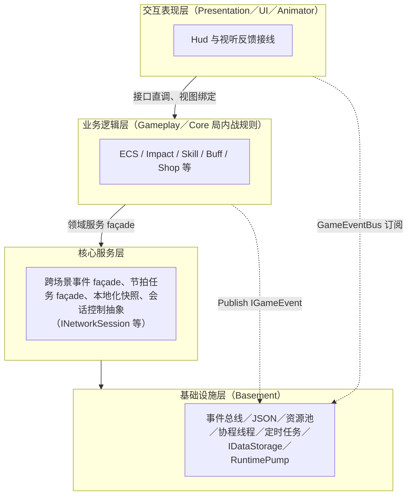
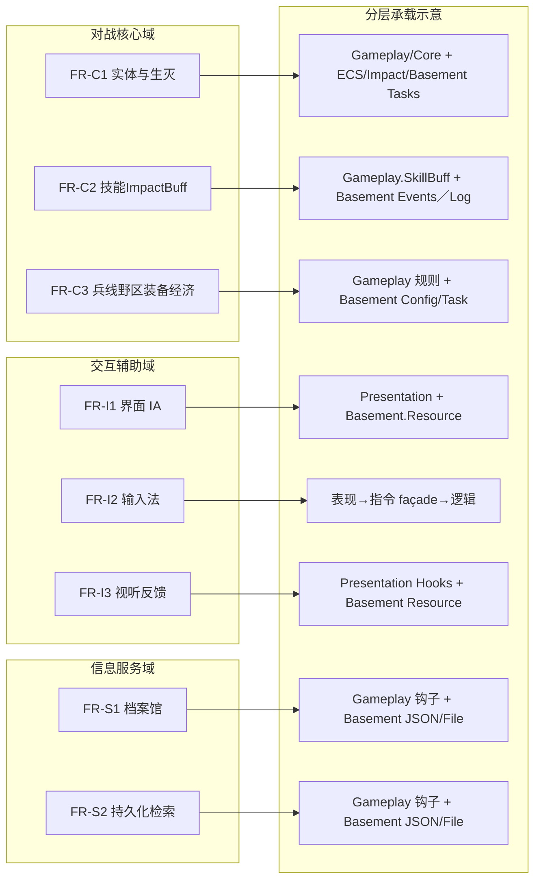

# 第二章　需求分析、可行性及总体设计方案

## 2.1 功能性需求分析

本节基于软件需求分解原则，将俯视角MOBA客户端所需核心能力划分为对战核心、交互辅助与信息服务三个维度。明确各维度可观测、可验收的行为需求，再后续总体设计中完成需求与具体子系统、接口的对应映射，确保需求落地的可追溯性。

### 2.1.1 对战核心需求

对战核心域是支撑MOBA游戏可玩性与规则正确性的核心，在需求规格中优先级最高，直接决定游戏核心体验，具体需求如下：

（1）角色与实体管理。用户进入对局前，可浏览所有可选英雄的属性区间及技能详细说明；进入对局后，系统需对所有可操控、可交互的游戏实体（英雄、兵线、野怪、工事等）进行统一生命周期管理与数值状态维护，涵盖生命值、法力值（或替代资源）、攻防属性、朝向及占位信息等核心参数。所有实体状态变更需具备明确触发源，包括计时触发、伤害作用、增益/削弱效果等，且状态数据需支持上层表现层调用及数据访问接口读取，为后续数据统计与分析提供支撑。

（2）战斗与技能执行。用户通过键鼠配合发起技能操作时，系统需按流程完成全链路校验与执行：首先进行语义合法性校验，包括操作距离、朝向、技能冷却时间及资源阈值等；其次完成技能弹道或作用范围的几何建模与渲染；随后判定技能与其他游戏实体的命中关系；最后套用与技能表定义一致的效果（伤害、控制、增益等）。同时，技能执行过程中的可视化反馈与音效输出需与逻辑执行节拍严格对齐，避免因表现层节流导致操作手感断裂，保障用户交互体验的连贯性。

（3）战场规则与子系统协同。MOBA对局战场按语义划分为路线、野区、工事等核心区域，系统需通过配置驱动的节奏参数，实现兵线推进、工事自动还击、野区实体定时刷新等对局核心节拍控制。在经济系统层面，需准确承载补刀、击杀、装备消费等经济变动逻辑，实现经济数据的实时记账与更新；装备系统需基于装备定义，形成可追溯的属性变更路径，明确装备对英雄属性的影响关系，为游戏平衡性调整提供可对比的数值依据。

对战核心域需求在后续总体架构设计中，将统一收敛于业务逻辑层，对应实体管理、ECS节拍、Impact管线、Buff及技能流水线、商店与装备等相关命名空间，同时通过基础设施层的事件调度与配置接口，获得时序控制与数据支撑。

### 2.1.2 交互辅助需求

交互辅助域聚焦于用户操作体验优化，核心目标是将战场态势与操作意图以低认知负担的方式呈现给用户，对应主流软件质量模型中的易用性、人机界面容错等相关要求，具体需求如下：

（1）信息与界面设计。战斗界面需对角色状态、快捷技能栏、小地图、对局概要、资源与经济数据等高密度信息进行结构化排布，确保用户可快速获取关键信息；非战斗界面（档案馆、编队设置、系统设置等）需保持清晰的导航路径，降低用户操作成本。多分辨率自适应为明确需求，控件锚点与字体缩放策略需适配常用笔记本分辨率区间，确保界面无裁剪、无错乱，保障不同设备下的界面一致性。

（2）操作与输入法适配。系统以键鼠为基础输入方式，为角色移动、普攻、技能释放等核心操作提供直观的默认键位映射；在工程实现允许的前提下，预留用户级键位重绑定入口，满足不同用户的操作习惯。输入事件需进行抽象处理，仅以语义化指令与逻辑层耦合，降低后续替换输入后端时的代码改动范围，提升系统可维护性。

（3）感官反馈控制。从界面控件交互到局内技能释放，音视频反馈需与事件总线上的领域事件或可订阅钩子精准呼应，在不侵入业务核心逻辑的前提下，保障全系统表现的一致性。同时，需提供全局音量调节、画质参数调节等接口，适配不同实验设备的性能差异，提升系统的兼容性。

交互辅助域需求在架构层面主要映射至交互表现层，同时与Basement的资源加载、调试输出等横向能力形成协同，共同保障用户交互体验。

### 2.1.3 信息服务需求

信息服务域主要覆盖对局生命周期之外的信息管理需求，核心目标是实现游戏信息的可查询、可存档、可按时间检索，为用户提供完善的信息服务支持，具体需求如下：

（1）静态档案管理。英雄数值基线、技能说明文本、叙事性占位字段等静态信息，需从配置文件或内容包中统一载入，通过统一的信息查询façade向上层提供只读快照，便于UI界面及其他工具模块调用，确保静态信息的一致性与可维护性。

（2）对局记录与分析。对局结束后，客户端需对对局时长、胜负结果、选用英雄摘要、经济数据、伤害统计等核心项目进行结构化存储或缓存，支持用户通过列表浏览、时间筛选等方式检视历史对局数据；图示化展示可作为UI增强项，纳入同一需求族，提升对局数据的可读性。

信息服务域的实现需依赖业务逻辑层中的信息管理语义，结合Basement的JSON序列化、文件存储通路等能力，完成数据的持久化与查询功能。

### 2.1.4 功能需求条目与架构映射

为确保需求与架构设计的可追溯性，列出部分高层次功能需求条目与对应承载层次的映射关系，详细字段级追溯可在后续设计与测试文档中进一步延展。

| 编号 | 需求简述 | 主要承载层次 |
|:---:|:---|:---|
| FR-C1 | 英雄与中立单位的属性、状态与时间敏感行为 | 业务逻辑层（实体、ECS、Impact）；基础设施层（时序调度） |
| FR-C2 | 技能校验、弹道/范围语义、Buff 套用与管线节拍 | 业务逻辑层（技能、Buff、战斗）；Basement（事件、日志） |
| FR-C3 | 兵线节拍、工事与野区规则、经济与装备链路 | 业务逻辑层；Basement（配置、任务调度） |
| FR-I1 | 战斗与非战斗视图的信息架构 | 交互表现层 |
| FR-I2 | 输入抽象与可配置键位 | 交互表现层→事件/指令 façade |
| FR-I3 | 视听反馈挂载点 | 交互表现层；Basement（资源管理） |
| FR-S1 | 角色档案浏览 | 业务逻辑域数据；表现层视图 |
| FR-S2 | 对局记录的持久化与查询 | Basement（JSON、文件）；业务逻辑钩子 |

## 2.2 非功能性需求分析

### 性能与交互响应性

在目标硬件平台运行的可执行程序，对局过程中需维持稳定的帧节拍区间，确保用户核心操作链条（移动、普攻、技能释放及可见反馈）无明显规律性停顿，保障游戏流畅度。针对资源占用峰值，需通过工程优化手段（如对象池化、按需异步加载等）进行有效控制，避免资源过度占用导致的系统卡顿。

### 可靠性与容错

核心逻辑路径在遭遇异常输入（如数值越界配置、瞬时重复指令等）时，不得出现进程级崩溃；对于可预见的反常执行路径，需生成可解释的日志条目，为教学场景下的故障回放与问题分析提供支撑。Basement层的日志管理与事件派发模块，承担横切关注点的容错与诊断功能，保障系统稳定运行。

### 可维护性与可演进性

系统设计需严格遵循分层架构与显式契约原则，缩短单点改动的影响范围：基础设施层不得出现具体MOBA业务相关词汇，确保底层能力的通用性；Gameplay层不得出现引擎全局单例的散落访问，避免代码耦合度过高。同时，采用配置文件驱动的数值区间管理方式，允许非程序员角色在既定流程内调整数值参数，并可纳入版本库进行差异对比，提升系统的可维护性与可演进性。

## 2.3 可行性论证

本节沿用软件工程可行性研究的标准框架，从技术、经济、法律合规性三个维度，结合本科毕业设计的实际条件，论证本项目的可行性，确保项目可在规定周期内顺利完成并达到预期目标。

### 技术可行性

本项目选用Unity引擎作为交互内容宿主，以C#作为主要开发语言，二者在可视化调试、预制体工作流程、托管内存管理等方面的特性，与本课题的规模及需求高度匹配。本科课程体系已覆盖面向对象编程、基本数据结构、常用设计模式等核心知识点，能够满足以接口设计与分层架构为核心的代码组织需求。

在基础设施层（Basement）建设方面，模块化事件总线、JSON配置文件管线、通用资源池、协程式任务调度等核心能力，与教材中“横切关注点抽离”“数据驱动外围参数”的软件工程理念一致。目前工程已按命名空间边界，划分出Basement、Gameplay、Core、Presentation等可分治区域，可采用递增集成策略推进开发，其中ConfigurationManager、JsonManager、ResourcePoolManager等核心类型，已为上层模块提供了成熟的接口契约。

针对多端联通需求（若有），采用“Thin Adapter”技术路线，由项目自备会话控制抽象与生命周期钩子，对齐引擎核心能力，将第三方链路库作为可替换的实现细节，确保论文论述重心聚焦于本校工程脚本与接口语义，符合本科毕业设计的技术定位。

综合来看，本项目不依赖无文档支撑的新兴语言或专有硬件，所有技术选型均为成熟、可复现的方案，在本科教学环境下具备充分的技术可行性。

### 经济可行性

本毕业设计以个人开发为核心，不产生大规模人力外包成本。Unity个人版与学习版许可，可完全满足教学展示与开发需求；可视化、音效等素材，可选用具备明确授权的免费资源或自制原创内容，无需额外采购；Rider、Git等开发与版本管理工具，在高校实验室及个人设备上已广泛应用，无需额外投入成本。项目采用离线或局域网演示形态，避免了对商业云带宽与长租服务器的需求，整体开发成本低，具备充分的经济可行性。

### 法律与合规可行性

本项目所使用的第三方美术、音频等资产，将严格选用与毕业设计非营利展示用途一致的授权资源；若涉及生成式工具制作的内容片段，将在论文致谢或附录中明确说明来源与制作方法，确保知识产权合规。本地化存档若包含用户自定昵称等弱标识信息，将遵循最小够用原则，同时提供数据删除功能，符合个人信息保护相关要求。综上，在法律与合规层面，无阻碍课题按计划结题的刚性约束。

## 2.4 总体架构设计

基于前文需求分析与可行性论证，结合软件工程分层架构设计理念，制定本项目总体架构，明确各层职责、依赖关系与核心设计原则，为后续详细设计与开发提供指导。

### 2.4.1 设计原则

本项目总体架构严格遵循“高内聚、低耦合、单向依赖”的核心原则，具体要求如下：

（1）垂直单向依赖：交互表现层依赖业务逻辑层提供的语义支持，业务逻辑层依赖核心服务层与基础设施层的能力支撑，底层模块不得直接引用上层模块（如基础设施层不引用上层UI组件），确保架构的清晰性与稳定性。

（2）横切关注点收敛：诊断日志、结构化配置、时钟推进、异步IO等通用资源型能力，统一归入Basement（基础设施及横切运行时），Gameplay层仅通过薄façade接口调用相关能力，避免横切逻辑散落导致的维护成本增加。

（3）通信双通道：采用“接口直调”与“领域事件通知”双通信模式，接口直调用于强类型编译期可查的紧邻模块协作，确保调用的准确性；领域事件通知用于一对多订阅场景，降低模块间的命名空间粘连，提升系统灵活性。两种通信方式在工程中，分别通过C# interface/abstract接口与Basement.Events/Basement.Events.Unity承载的事件总线实现。

上述设计原则与MVC/MVP架构在游戏领域的变体应用相一致，实现“视图与控制器轻量化、业务逻辑向领域脚本与数据结构沉淀”的设计目标。

### 2.4.2 四层逻辑结构划分

本项目自顶向下划分为交互表现层、业务逻辑层、核心服务层、基础设施层四层逻辑结构，与初期报告及各设计说明中的表述保持一致，且已得到当前代码目录拓扑的验证，各层职责与功能如下：

（1）基础设施层：核心职责是对Unity编辑器与运行时专有API进行Facade适配，隔离引擎底层细节；同时负责预制体与高噪声资源的池化生命周期管理、运行时JSON配置的加载与合法性校验、多级别结构化日志输出、脚本级协程/线程派发辅助等。该层严格避免出现MOBA业务相关名词，确保底层能力的通用性，为引擎版本迁移与单元测试预留空间。

（2）核心服务层：在基础设施层之上，组装全局可复用的事务型服务，核心职责包括跨场景事件调度、TimingTaskScheduler/TaskDispatcher支撑的节拍型任务管理、JsonManager参与的本地化持久化快照、以及与“会话视图”对齐的INetworkSession控制抽象的外观实现。其中，会话相关细节由薄适配层封装，本节不展开第三方链路库的具体实现。

（3）业务逻辑层：聚焦于MOBA对局核心语义，采用ECS（实体-组件-系统）与面向对象脚本混用的实现方式。EcsWorld与各IEcsSystem（兵线推进、工事周期、瞬时伤害投递、生命值结算、Buff节拍、技能管线等）在同一帧拓扑内按顺序执行；ImpactManager/ImpactSystem构成的伤害链、BuffManager、技能流水线、商店与装备规则等，共同构成游戏规则内核，确保规则的可读性与可维护性。

（4）交互表现层：负责游戏视觉与听觉表现的实现，包括Animator驱动的单位动画、受击反馈、血条显示等，以及与UI Toolkit或UGUI绑定的HUD界面。该层通过事件监听或数据绑定的方式，获取业务逻辑层的状态信息并进行展示，不直接写入核心规则，确保表现层与逻辑层的解耦。Presentation目录下的接线脚本以“轻量化”为核心，与Gameplay/Core模块并行开发，降低模块间耦合。

四层架构的依赖关系如图2-1所示（排版时需使用Visio/PowerPoint，按课程模板重绘为矢量图）。

#### 图 2-1　四层架构与依赖方向的逻辑示意

说明：架构层次自上而下依次为交互表现层→业务逻辑层→核心服务层→基础设施层；箭头表示模块间的允许依赖方向；侧边需并列标注“事件通知”与“接口直调”两种通信方式。

以下为 **Markdown 附录用 Mermaid** 图示（可由 [Mermaid Live](https://mermaid.live) / Typora / VS Code 预览渲染）；学校定稿装订时请将同构内容重绘为 **Visio／PowerPoint 矢量图**，替换或与之并列编入正文。

#### 图 2-2　功能需求三维子域与章节 2.1.4 条目映射示意

下图将「对战核心—交互辅助—信息服务」三块需求与子条目的主要落点可视化，可与 **§2.1.4 功能需求条目与架构映射表**对照阅读。

## 2.5 关键技术选型

本节明确影响系统全局实现路径的核心工程决策，选型遵循三大标准：一是可获得长期维护的官方或社区文档，确保技术的可学习性与可支持性；二是能在本科教学环境中稳定复现实验，符合毕业设计的技术定位；三是有利于模块边界清晰，提升系统的可维护性与可演进性。具体选型如下：

### 引擎与宿主语言

选用Unity Editor作为开发引擎，其提供的专业内容管线、预制体管理、物理引擎、Animator动画系统等一体化工作台，能够高效支撑MOBA游戏的开发需求；宿主语言选用C#，利用其静态类型检查、现代语法特性，支撑大规模脚本协作，降低代码出错率。二者的搭配是当前交互式软件开发教育中最成熟、最稳妥的组合，符合本科毕业设计的技术要求。

### 数据交换与配置文件

运行时参数、策划表驱动的技能与装备条目等，采用JSON作为主要数据交换格式；工程中通过Basement层的ConfigurationManager、JsonManager，结合Newtonsoft.Json组件，实现JSON数据与C#强类型的绑定及容错解析。相较于将数值常量直接写入代码，该方式符合数据驱动开发理念，便于参数调整与持续集成中的差异对比，提升系统的可维护性。

### 运行时通信与节拍

全局范围的可订阅通知，通过GameEventBus、IGameEvent语义实现，支撑模块间的解耦通信；与时间相关的节拍控制，通过TimingTaskScheduler、TaskDispatcher与Unity自带的CoroutineManager协同实现，保障对局节奏的稳定性。“事件+节拍”的双线模型，使瞬时离散事件与时间区间事件在架构上实现对等处理，降低业务脚本自行维护计时器导致的代码冗余与出错风险。

### 并发与ECS宿主

在多实体并发场景中，采用ECS架构的EcsWorld/IEcsSystem/UpdateOrder，为游戏规则内核提供可排序的Tick执行机制，提升多实体场景的运行效率；同时，采用ECS与MonoBehaviour脚本共存的混合动力模式，使表现层的动画控制等功能，可沿用成熟的Animator API，实现“规则集中、表现分散”的工程折中，兼顾运行效率与开发便捷性。
