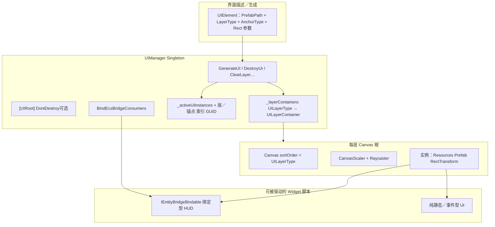

# 第五章　交互表现与用户界面

前文已从 Basement 底座与 Gameplay/Core 局内核角度，论述了 ECS 节拍、Impact、技能管线与经济数据流。本章将视角上移到**交互表现层**：说明**键鼠与射线如何转化为语义指令**、**画布层级与运行时生成的 UI 如何挂上逻辑桥**、以及** Animator 与世界空间反馈如何与战斗结算单向耦合**。行文以工程脚本与契约为主，弱化具体控件配色、字体与艺术构图，而把笔墨放在「谁订阅谁、在什么生命周期绑定、如何保证不写回规则」等与软件架构直接相关的议题上。

与**具体业务相位、场景迁移**相关的冻结说明见《毕设演示-端到端场景与界面流转.md》等姊妹文档；**本章 5.2 专述 UI 子系统的代码级组织结构**（`UIManager`、`UIElement` 等），不把单机闭环逐步叙述作为主干。胜负与结算界面字段底线见《MOBA对局信息与胜负流程模块设计文档》。**局域网房间入口**仍按第二章 façade 策略视为可选用扩展。

---

## 5.1 操作与输入范式

俯视角 MOBA 在桌面上通常采用**键鼠一体**的操控模型：**相机俯览战场 + 地面上点选目标/目的地 + 快捷键触发战斗动作**。工程中并未将输入堆叠在零散的全局布尔量中，而是由若干 **`MonoBehaviour` 宿主脚本**各司其职，并在需要处与 ECS 侧的选敌与黑板服务拼接。

### 5.1.1 地面移动：`MovementController` 与射线—NavMesh 语义化

玩家的**点击移动**路径由宿主单位上的 **`MovementController`**（工程路径 `Gameplay/Base/`，无单独 `namespace`，与 Unity 默认程序集装配）承担：在配置的按键（默认为鼠标侧键，`KeyCode` 序列化可被关卡或Prefab 改写）按下时，自 **`Camera.main`** 投射屏幕射线与地面碰撞几何求交；命中点再通过 **`NavMesh.SamplePosition`** 投影到可走网格，得到满足 **`NavMeshAgent.SetDestination`** 约束的世界坐标。**`reactToPlayerMoveInput`** 开关允许同一Prefab 在单位类型上关闭寻路监听（如木桩、纯 AI），避免与主控单位竞争导航入口。该写法将「射线—导航可行性—Agent 命令」三件事收束在同一组件内，对上层玩法而言即是**离散输入 → 语义化移动意图**的一层薄适配。

当 Agent 初始化未落在网格上时，脚本通过 **`TryEnsureAgentOnNavMesh`** 在半径内抓取合法点并对 Agent  **`Warp`**，属于对 Unity 导航系统常见边角条件的**容错封装**，可降低演示场景中「单位出生在网格外」导致的不可玩概率。

### 5.1.2 普攻与调试桥：`Gameplay.Combat.Targeting` 与键位触发

单机调试与 MVP 验收路径下，普攻可由 **`MvpHeroBasicAttackDebugBridge`**（`Gameplay.Combat.Targeting`）以 **`Input.GetKeyDown`** 驱动的形式触发：一端委托 **`DefaultTargetAcquisitionService`** 构造 **`TargetAcquisitionRequest`**（如最近敌对球体语义），另一端在取得 **`TargetAcquisitionResult`** 后经黑板提交并调用 **`DefaultCombatImpactDispatch`**，与第四章所述「普攻读 `CombatBoardLite`、不经技能管线」一致。键位（如空格、回车类缺省）在 Inspector 暴露，使**输入物理键与战斗语义**在工程上可分文件迭代，而未与 Animator 帧事件强绑定——后者由 **`UnitAnimDrv`**（见§5.3）在完成手感对齐时收口。

本章不把「商业化完整输入重绑定」作为主结论；若以《局内输入与NewInputSystem接轨设计》等为后续工作，可在展望中写明 **Input Actions 映射表**如何将上述语义从 Legacy Input 迁至 **`UnityEngine.InputSystem`**，本节仍以上述**已实现宿主脚本**为准。

---

## 5.2 界面信息架构：`UIManager` 与 `UIElement` 组织模型

表现层若把每个界面都在场景中常驻摆放多枚 `Canvas`，极易出现 **sortingOrder 冲突、Prefab 冗余、运行时难以按层清空**等问题。本项目在 **`Core.UI`** 下用 **`Singleton<UIManager>`** + **描述对象 `UIElement`** 把界面生成抽象为：**「落在哪一层、用哪份 Resources 预制、相对全屏画布如何锚定」**。业务侧（菜单、HUD、结算、弹窗）仍可各自使用独立 Prefab 做视觉设计，但与**画布根、绘制顺序、跨分辨率缩放策略**有关的共性则集中在管理器内实现，从而降低「散落在各场景的魔法数」。具体对局到哪一相位再显示何种 Panel，则由上层编排与姊妹文档约束，本节不逐步展开工作流程。

### 5.2.1 `UIElement`：一次生成的「界面描述符」

**`UIElement`** 是普通 C# POJO（非 `MonoBehaviour`），承载一次生成所需的**可变参数**：**`PrefabPath`**（传入 `Resources.Load` 的子路径）、**`LayerType`、`AnchorType`、`Position`、`Size`**、可选 **`DontDestroyOnLoad`** 与生成后的 **`UiInstanceId`/`IsGenerated`** 状态。**`SetDefaults`** 提供合理缺省（如默认 `MainUI` + `Center`），上层或封装方法只需覆写差异化字段。**设计意图**是：把「如何定位」从美术 Prefab 内部抽出一层脚本契约，便于**程序化批量生成／回归测试／在不含该 Canvas 的空场景中进行单元式调试**——生成端只关心描述符是否合法，而不必在代码里手写 `Instantiate(parent)` 的层级猜测。

### 5.2.2 `UILayerType`、`UIAnchorType` 与 `UILayerContainer`

**`UILayerType`**（`Background` → `MainUI` → `HUD` → `Popup` → `TopTip`）不是简单的标签，而是**与 `Canvas.sortingOrder` 一一对应的序空间**：枚举的整型值直接赋给 `Canvas.sortingOrder` 并配合 **`overrideSorting = true`**，使「谁盖住谁」在类型系统内可静态阅读，避免多个屏幕特效与菜单抢同一排序值。**`UIAnchorType`** 则描述 **生成实例根 `RectTransform` 相对其所在层全屏 Canvas 的锚点策略**（角点/边中/中心等），由 **`SetAnchorRectTransform`** 统一实现，避免每个 Widget 脚本重复写一遍锚点数学。

**`UILayerContainer`** 是轻量 DTO：持有该层根 **`GameObject`** 与 **`Canvas`**。**`UIManager`** 内用 **`Dictionary<UILayerType, UILayerContainer> _layerContainers`** 做**懒创建**——只有某层第一次被请求时才 `CreateLayer`，在该层根上挂 **`Canvas` + `CanvasScaler`（ScaleWithScreenSize，设计分辨率 1920×1080）+ `GraphicRaycaster`**。**作用**有三：其一，**一层一 Canvas** 符合 Unity UGUI 对排序与射线拾取的常见实践；其二，**Scaler 集中配置**保证不同笔记本分辨率下同一套 Prefab 的伸缩策略一致；其三，**层内所有实例共用一个排序根**，避免「每个 Widget 自带独立 Canvas」带来的 Overdraw 与 Raycaster 重复。

### 5.2.3 `UIManager` 内部登记与生命周期 API

除层级缓存外，**`UIManager`** 维护 **`Dictionary<Guid, GameObject> _activeUiInstances`** 及与之并行的 **`_uiInstanceLayers`、`_uiInstanceAnchors`**，把**实例身份、所在层、锚点类型**绑定在 GUID 上。**`GenerateUI(UIElement)`** 完成：路径校验 → 取/建 `UILayerContainer` → `Instantiate` 到层根 → 应用锚点与尺寸 → 可选 `DontDestroyOnLoad` → 注册 GUID。

这一登记结构支撑以下**高层能力**：

1. **按 ID 精确销毁**（`DestroyUI(Guid)`），避免 `Destroy(Find("xxx"))` 类脆弱写法；  
2. **按层批量清理**（`ClearLayer`），适合「进入新对局时清空 HUD 层、保留 MainUI」等模式；  
3. **按层+锚点局部清理**（`ClearLayerAnchor`），适合同一层多种角标 Widget 的定点回收；  
4. **查询层内实例列表**（`GetLayerUIInstances`），供调试或上层编排批量操作。

**`Cleanup`** 在进程退出或显式重置时遍历销毁，防止 `DontDestroyOnLoad` 节点泄漏。整体而言，该组织方式把 **UI 的运行时集合论**（存在哪些实例、属于哪一层）放在**单处真相源**，与 Gameplay 状态机正交，便于单元测试与工具化。

### 5.2.4 架构所驱动的界面形态（而非具体美术稿）

在上述契约下，**同一套 `UIManager` 管线可驱动**：

| 形态 | 典型 `UILayerType` | 说明 |
|:---|:---|:---|
| 全屏或大幅底图/氛围层 | `Background` | 与战斗无关的视觉衬底或可切换的静态底板 |
| **主功能区**（菜单、编队、局域网入口等业务壳） | `MainUI` | 占据交互主干，通常 Center/全屏stretch 型 Prefab |
| **局中 HUD**（属性条、小地图占位、技能栏数据绑定区等） | `HUD` | 与 `Playing` 长期共存时需稳定排序与高刷新安全的只读控件 |
| **模态对话框、确认框** | `Popup` | 需要盖住 HUD 但不会长期常驻 |
| **顶部飘字、toast、调试浮层** | `TopTip` | 最短声明周期与最高绘制优先级 |

工程中 **`TrySpawnDetailStatement`** 即用封装好的 **`UIElement`** 常量路径（`DetailStatementResourcePath`）+ 默认 **`HUD` + BottomLeft**，生成**局内单位属性读出面板**的树；视觉上仍是普通 UGUI Prefab，**组织架构上**则被归类为 HUD 层的可挂载子树。**任意同类 Resources 预制**只要遵守 RectTransform 根节点惯例，都可以通过 **`GenerateUI`** 或薄封装并入上述谱系——这是「驱动什么样的界面」的准确含义：**驱动的是层级—锚点—预制路径所刻画的一类装配关系**，的具体皮肤由 Prefab 决定。

### 5.2.5 视图与 ECS：为什么需要 `BindEcsBridgeConsumers`

UGUI 控件若直接 `Find`/单例拉取 `EcsWorld`，会破坏第二章的分层约束。本项目用 **`IEntityBridgeBindable`** 标记「需要 **`EcsEntityBridge`** 才能读数的 `MonoBehaviour`**」，由 **`Bind(EcsEntityBridge)`** 完成注入。**`BindEcsBridgeConsumers`** 在 UI 实例根上做子树枚举并调用 **`Bind`**，解决 Unity 无法用接口类型做 **`GetComponentsInChildren<IEntityBridgeBindable>`** 的局限。**典型驱动对象**包括 **`DetailStatItemManager`**：在 **`Bind`** 后仅从 **`EntityDataComponent`** **读快照**写 TMP 文案，不写回 ECS，保证**视图侧的观测关系可审计、可追溯**。

**`UIManager` 与各业务 Prefab、桥接约定的关系（结构示意）：**

---

## 5.3 视听与反馈驱动脚本（不写回规则的契约）

Unity 视听侧将 **Animator Controller（`.controller`）**与 **`UnitAnimDrv`** **并列**叙述：前者说明引擎内**动画状态编排**的机制与边界，后者说明工程如何**单向驱动**该机制并与战斗链路接驳。

### 5.3.1 Animator Controller 与动画状态机（概念与工程角色）

**Animator Controller**用**状态（State）—转移（Transition）**组合 **`AnimationClip`**：转移条件由 **`Animator` 参数**（如 `Bool`/`Float`/ **`Trigger`**）刻画，运行时按帧完成跃迁。**Blend Tree** 在单个状态内按标量（如 locomotion **`Speed`**）混合多段剪辑，避免纯离散状态堆砌；**Animation Event** 在 Clip 时间轴回调宿主脚本，本作以 **`AnimEvt_Strike`** 将「观感出手帧」接到 **`ICombatImpactDispatch`**，命中判定仍在 Targeting/Impact。**`RuntimeAnimatorController`** 由 **`UnitModelAssembler`** 尽早注入 **`Animator`**；关闭 **Root Motion**、位移交给 **`NavMeshAgent`**，即**位移权威在导航、状态机管姿态**的常见分工。总体上，Animator 子系统是**表现层中间件**：玩法不读当前结点名作规则；与 C# 的契约落在**参数、Trigger 与事件**三条窄带上，与 §5.3.2 的 façade 一一对应。

### 5.3.2 `UnitAnimDrv`：参数、事件与逻辑的单向耦合

**`UnitAnimDrv`**（`Gameplay.Presentation`）承担上述窄带的**集中实现**：在 **`Awake`** 缓存 **`Animator.StringToHash`**，按序列化字段写入 **`Speed`、`IsDead`、`IsGrounded`** 等连续/布尔语义，以 **`SetTrigger`** 派发 **`Attack`/`Skill`/`Hit`** 等离散动作，避免战斗模块散落哈希细节。Locomotion 侧综合 **`NavMeshAgent`** 与根节点平面位移估计，将归一化速度写入混树参数，与 Controller 中 Blend 阈值配置对齐；**`animatorDisableRootMotion`**、**`animatorAlwaysAnimate`** 等开关把「与导航/裁剪相关的引擎行为」收在表现脚本内。普攻以 **`AnimEvt_Strike`** 为主通道，并可用 **`strikeFallbackDelaySeconds`** 作时间轴未埋点时的**保守回退**，二者均只调用 **`ICombatImpactDispatch`**，不反向查询 Animator 内部图结构。

**受击**路径上，`ImpactSystem` 经 **`HitFxRelay.RaiseHpDamaged`** → **`EntityEcsLinkRegistry`** → **`UnitAnimDrv.NotifyDamaged`**，统一触发 **`Hit`** **Trigger** 与可选 **`IUnitHpBarFeedback`**，保持 **Impact → 表现** 单向性。

### 5.3.3 HUD 颤动、模型装配与相机接驳

**血条/UI 颤动**不与 Impact 直呼：宿主上可挂 **`IUnitHpBarFeedback`**，`UnitAnimDrv` 在 **`NotifyDamaged`** 内以 **`is IUnitHpBarFeedback`** 动态派发 **`OnHpDamagedShake`**。这样 HUD 控件不必出现在 **`Core.Combat`** 命名空间中，却仍能与受击节拍同步。

**`UnitModelAssembler`**（`View.UnitModel`）在早于默认 **`DefaultExecutionOrder(-50)`** 时把 FBX／模型 Prefab **实例挂到本地 `ModelRoot` 锚点**并赋值 **`RuntimeAnimatorController`**，保证 **`UnitAnimDrv`** 在 **`Awake`** 中能稳定 **`GetComponentInChildren<Animator>`**。这是**表现资源装配次序**的工程约束，可比作小型「构建管线前置步骤」。

**相机**：**`CameraController`** 可选用 **`TestPlayerSpawner.TestPlayerSpawned`** 静态事件，在自动生成玩家根 Transform 后与俯视角偏移、LookAt 策略绑定，解除 UI 脚本与相机的硬编码引用。

---

## 5.4 典型案例与占位图示（版面从简）

**案例一（属性 HUD）**：同上 **`DetailStatement` + DetailStatItemManager + Bridge Bind`**。

**案例二（输入—移动—普攻链）**：`MovementController` 射线位移 → `MvpHeroBasicAttackDebugBridge`/`UnitAnimDrv` 动画出手 → **`DefaultCombatImpactDispatch`**→ Impact；血条颤动经 **`HitFxRelay`/`IUnitHpBarFeedback`**。

> **图5-1（建议）**：`UIElement`→`GenerateUI`、`UILayerType`/`UILayerContainer` 分层、`Guid` 登记与 `DestroyUI/ClearLayer` 回收、`BindEcsBridgeConsumers` 与 **`UnitAnimDrv`/`HitFxRelay`** 分岔；定稿矢量重绘。

---

## 本章小结

本章从**可操作性与可挂载性**角度归纳交互表现层的工程实现：**键鼠与射线经由 `MovementController`、Targeting 调试桥薄化为语义指令**；**`UIElement` 与 `UIManager` 建立「层级—锚点—Resources 预制」的可程序化管理模型，并以 `Guid` 登记支撑按层／按实例的回收**，从而驱动菜单壳、局中 HUD、弹窗与置顶提示等不同绘制优先级的界面族；**`IEntityBridgeBindable` 与 `BindEcsBridgeConsumers`** 将 HUD 控件与 **`EcsEntityBridge`** 的只读观测关系显式化；在视听侧，**Animator Controller 所刻画的动画状态机与 Blend Tree、Animation Event 构成表现层中间件**，由 **`UnitAnimDrv` facade** 写入参数与 Trigger，经 **`HitFxRelay`、`IUnitHpBarFeedback`、`UnitModelAssembler` 与 `CameraController`** 与战斗及场景宿主事件衔接且不污染规则内核。整体上与第三、四两章相承：**先有契约与宿主数据，再由本节的 UI／表现管线装配与呈现**。
