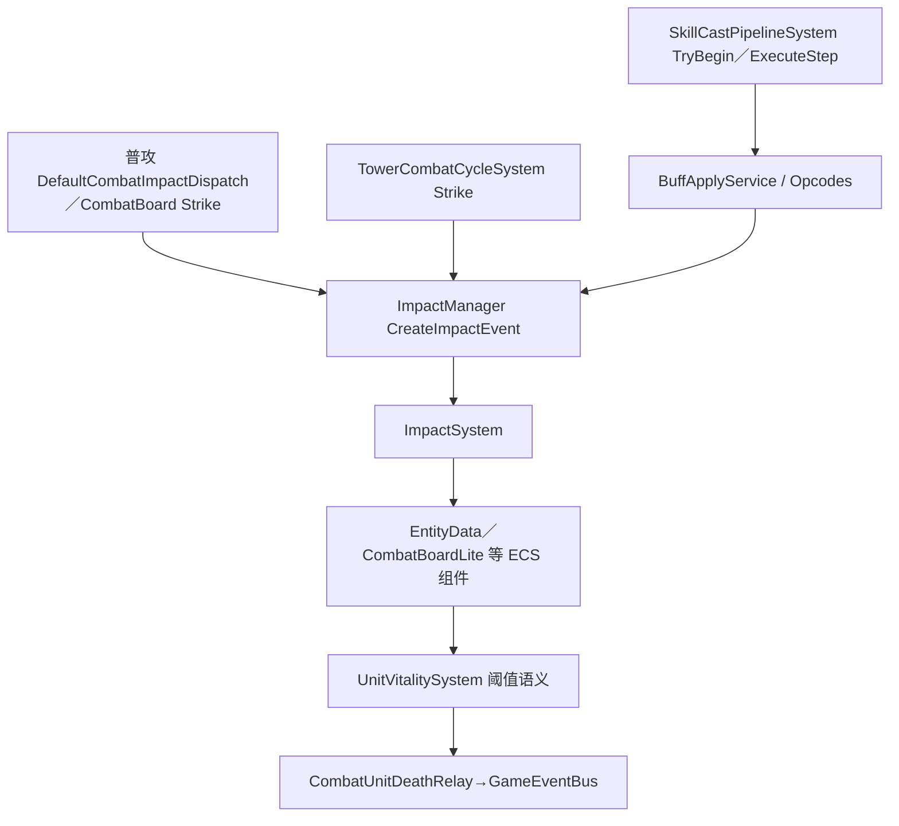
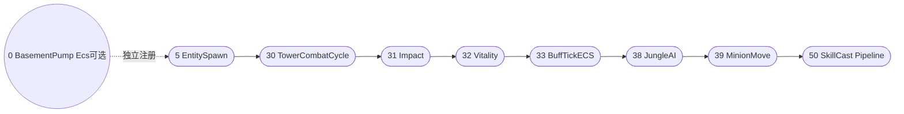
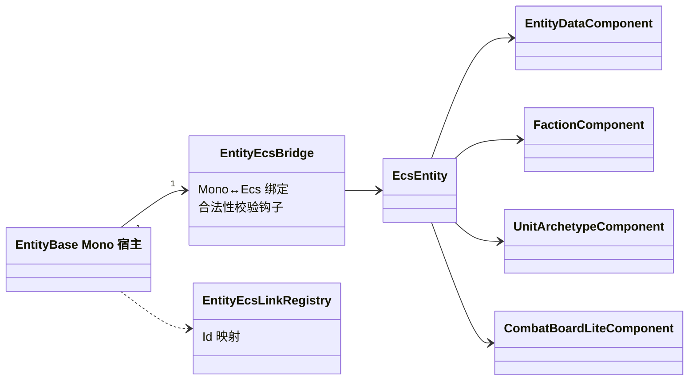
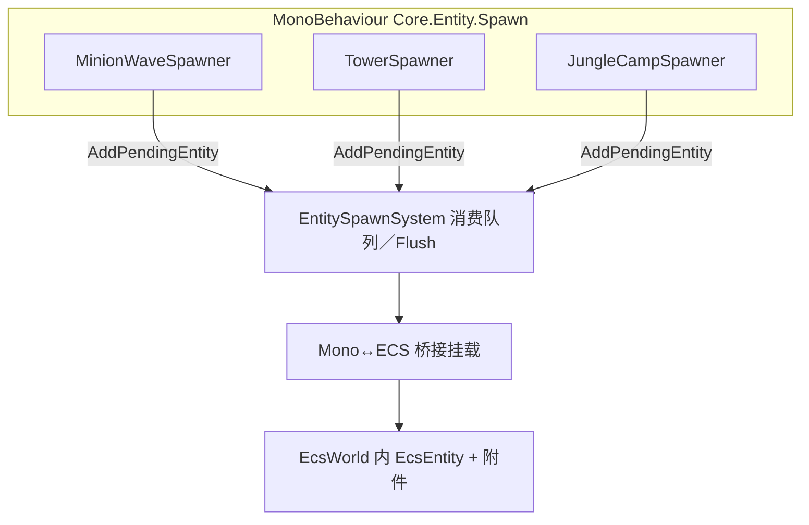
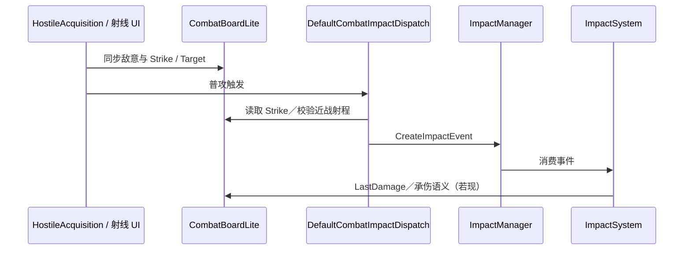
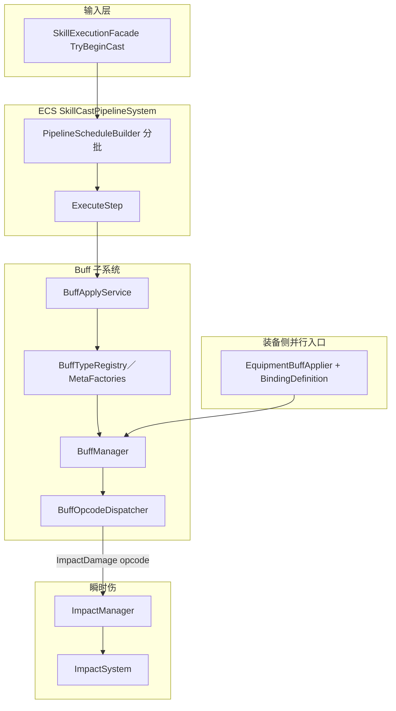
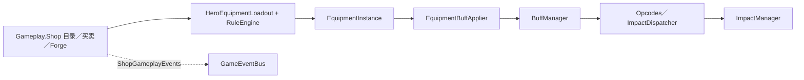

# 第四章 局内核心系统设计与实现

本章聚焦局内可玩逻辑的设计与实现，在单位实体、战场环境与经济数据三大核心要素之间，建立起清晰可追溯的控制流与数据流体系，确保俯视角MOBA游戏所需的核心链路——实体生成与存活管理、兵线与环境节拍控制、瞬时伤害与普通攻击机制、表驱动技能与Buff系统、商店与装备系统——能够在统一架构框架下实现增量开发与高效验证，同时严格遵循模块化设计原则，保障各子系统的独立性与协同性。

> 图4-1（建议）局内主干数据流示意：普攻/塔击Strike与Buff opcode汇入Impact系统后，触发实体核心数据的实时变更；技能施放进入分步执行管线，经BuffApply流程与opcode派发完成效果落地；当实体生命阈值达到临界值时，由UnitVitality系统触发判定，生成死亡事件并上传至全局事件总线。定稿时需用专业矢量图重绘，确保图表规范与论文整体排版风格保持一致，贴合本校毕业论文图表格式要求。

**图 4-1（Mermaid 主干数据流草稿）**，与《工程模块与命名空间—现行实现总览》§5「数据流鸟瞰」一致：

## 4.1 ECS世界与系统注册

局内逻辑的时序一致性是保障游戏体验流畅性的核心前提，若将时序耦合分散在各个功能模块中，极易导致逻辑混乱、调试困难等问题。本工程采用轻量级自定义ECS（实体-组件-系统）架构，由Core.ECS命名空间提供EcsWorld、EcsEntityManager两大核心基础组件，以及IEcsSystem/IEcsComponent两大核心接口契约，通过EcsWorld.Update方法按各系统预设的UpdateOrder枚举值执行所有IEcsSystem实例，在单线程主循环语义下，实现各模块执行顺序的可预测性，从根本上避免时序混乱导致的功能异常。

### 4.1.1 EcsWorld的职责边界

EcsWorld采用进程级单例模式设计，通过BeforeSceneLoad事件与EcsWorldInitializer完成Instance实例的预热与初始化操作，在Initialize阶段重点完成与各子系统的协同对接，包括与JsonManager的数据交互、与SkillCatalog的资源预加载协同，确保核心组件能够正常响应上层调用。值得注意的是，EcsWorld不直接负责具体局内逻辑的执行，仅提供基础的容器与调度能力，所有IEcsSystem实例均不在EcsWorld构造函数中直接注册，而是由场景引导脚本统一挂载，以此降低场景无关逻辑与编辑器播放域之间的耦合度，提升系统的可维护性与可扩展性。

### 4.1.2 GameplaySystemsBootstrap与控制流顺序

Gameplay侧的GameplaySystemsBootstrap脚本，在Unity的RuntimeInitializeLoadType.AfterSceneLoad钩子中完成局内系统的集中注册，具体流程为：先完成BuffManager.EnableEcsDriving()调用，确保事件总线与日志系统正常启用，再注册内置技能的基础条件配置，随后依次为EntitySpawnSystem、TowerCombatCycleSystem、ImpactSystem等核心系统调用TryAdd方法完成注册。该方法的核心优势的是，仅在对应系统实例未存在时执行AddEcsSystem操作，有效避免重复注册导致的资源浪费与逻辑冲突。

表 4-1 局内代表性IEcsSystem与UpdateOrder（现行实现节选）

| 系统类型                               | UpdateOrder（约） | 职责摘要                                    |
| ---------------------------------- | -------------- | --------------------------------------- |
| BasementPumpEcsSystem（可选，Basement） | 0              | 负责Basement侧节拍泵送，为所有上层系统提供基础运行支撑         |
| EntitySpawnSystem                  | 5              | 消费实体生成队列，完成桥接组件与扩展钩子的挂载，保障实体正常生成        |
| TowerCombatCycleSystem             | 30             | 控制防御塔节拍，完成目标搜索、Strike信息写入与Impact伤害投递    |
| ImpactSystem                       | 31             | 消费Impact实体，将伤害等效果精准应用至EntityData等核心数据组件 |
| UnitVitalitySystem                 | 32             | 完成实体生命阈值判定、击倒逻辑处理，记录凶手ID等死亡相关语义         |
| BuffTickEcsSystem                  | 33             | 驱动全局BuffManager的节拍与效果泵送，保障Buff效果正常生效    |
| JungleAiSystem                     | 38             | 实现野区单位简易AI逻辑控制，完成野区实体的行为驱动              |
| LaneMinionMoveSystem               | 39             | 实现兵线沿预设路线的移动控制，属于MVP/stub级基础实现          |
| SkillCastPipelineSystem            | 50             | 负责技能执行管线的分步调度与执行，保障技能效果有序落地             |

由表4-1可明确，塔与瞬时Impact伤害的结算、实体生命与Buff的节拍控制、兵线移动与技能管线推进，均在既定的UpdateOrder约束下执行，确保每一步逻辑的可追溯性。论文论述中若涉及帧内逻辑一致性的论证，需严格以UpdateOrder枚举值为依据，而非依赖日志输出的偶然顺序，确保论证的严谨性与科学性。

#### 图 4-2　Gameplay 注册的 IEcsSystem 每帧排序链（节选）

括号内近似值为代码中 `UpdateOrder`； `**BasementPumpEcsSystem`（0）位于 Basement/`AfterSceneLoad` 另一侧注册**，与同帧链路并列存在。

## 4.2 实体、黑板与战场信息

MOBA局内单位的核心信息包括“可交互性”“阵营归属”“攻击目标”等关键语义，此类信息若分散存储于MonoBehaviour的临时变量中，会导致逻辑冗余与维护困难。本系统通过Mono–ECS桥接层实现双向映射，由EntityEcsLinkRegistry负责映射关系的管理，EntityEcsBridge组件提供接口适配，确保场景中实体实例与ECS世界中的逻辑实体一一对应，实现表现层与逻辑层的解耦。

### 4.2.1 实体数据组件与阵营语义

EntityDataComponent组件作为核心数据载体，存储实体的HP、攻防属性等核心参数，这些参数可通过配置表动态修改，也是Impact伤害与Buff效果的主要作用对象。实体的阵营与兵种信息通过FactionComponent、UnitArchetypeComponent两个结构化组件共同表达，包含小队ID、兵种类型等关键信息，为大世界目标过滤、敌意判定、装备穿戴校验等功能提供稳定的查询接口，确保各子系统能够快速获取所需的实体基础信息。上述组件与Mono–ECS桥接层同步挂载于EntitySpawnSystem的生成路径中，实现“场景实体实例化”与“ECS逻辑实体创建”的同步完成，避免出现数据不一致的问题。

#### 图 4-3　Mono Host 与 ECS 逻辑实体概要类图（Mermaid）

### 4.2.2 CombatBoardLite与瞬时战斗语义

CombatBoardLiteComponent组件作为战斗黑板的核心载体，主要存储实体的主攻目标ID、Strike攻击信息、仇恨值变化、承伤记录等关键数据，是瞬时战斗信息的集中存储中心。防御塔的TowerCombatCycleSystem系统在既定节拍点向黑板写入Strike攻击信息，随后通过Impact链路完成伤害结算；Targeting侧的DefaultCombatImpactDispatch组件读取黑板中的Strike数据，完成攻击距离、近战规则等语义校验后，将Impact伤害事件投递至对应处理链路，确保攻击逻辑的规范性。

在实体击倒逻辑中，UnitVitalitySystem系统检测到实体生命阈值达到临界值时，会向CombatBoardLite写入KillerEntityId等核心信息，再由Gameplay.Entity.CombatUnitDeathRelay组件生成结构化死亡日志，通过UnitDeathEventHub与CombatUnitDiedGameEvent事件，将死亡信息上传至Basement事件总线，供UI界面、对局统计等模块订阅使用，既不侵入ECS内核逻辑，又能保障死亡信息的可追溯性。

## 4.3 兵线移动与环境交互设计

兵线作为MOBA游戏的核心战场节拍载体，其移动逻辑与环境交互的合理性直接影响游戏体验，本节从兵线移动控制、环境交互两个维度，阐述核心实现逻辑。

### 4.3.1 兵线模块与LaneMinionMoveSystem

Core.Entity.Minions命名空间下，不仅定义了兵线相关的ECS组件，还包含LaneMinionMoveSystem系统，该系统与路点运行时组件、兵种专用配置协同工作，在每帧既定的UpdateOrder节拍上，更新兵线的位移状态与路线约束，确保兵线移动符合游戏规则。根据《工程模块与命名空间总览》说明，该模块目前为stub/MVP粒度实现，架构槽位设计完备，可根据毕业设计工期安排，逐步迭代优化寻路逻辑，提升兵线移动的合理性与流畅性。

### 4.3.2 刷怪器与塔、野区节拍控制

防御塔的交战逻辑由TowerCombatCycleSystem系统驱动，核心节拍流程为：目标搜索→CombatBoardLite写入Strike信息→Impact链路完成伤害结算，确保防御塔攻击逻辑的独立性与稳定性。MinionWaveSpawner、TowerSpawner、JungleCampSpawner等生成器组件均位于Core.Entity.Spawn命名空间，采用MonoBehaviour实现，负责在场景指定位置向EntitySpawnSystem提交待生成实体队列，实现兵线波次、防御塔、野区营地的程序化生成。

野区相关逻辑由Core.Entity.Jungle命名空间提供支撑，JungleAiSystem系统负责野区单位的AI行为控制，与JungleCampSpawner组件形成分工协作模式，前者控制野区单位的行为逻辑，后者负责野区营地的生成与初始化，与第二章中“野区与经济”的高层需求保持高度一致，确保野区系统与整体架构的协调性。

#### 图 4-4　场景 Spawn 管线与 ECS 入网（刷怪器 → EntitySpawnSystem）

## 4.4 Impact与普通攻击链路

瞬时伤害与普通攻击是MOBA游戏的核心交互逻辑，若采用零散的方法调用实现，会导致逻辑冗余与维护困难。本系统通过抽象Impact实体事件，由Core.Gameplay命名空间下的ImpactManager统一管理，实现伤害事件的集中创建与分发，Core.Combat.ImpactSystem系统每帧消费Impact事件，将伤害效果应用至EntityData组件，确保伤害结算的准确性。

### 4.4.1 投递点与语义分层

Impact伤害的投递点按语义分为三类，均遵循统一的管线规范，具体如下：

（1）普攻与战斗黑板协同：Gameplay.Combat.Targeting命名空间下的DefaultCombatImpactDispatch组件，实现ICombatImpactDispatch接口，从CombatBoardLite黑板中读取Strike攻击信息，完成攻击距离、近战规则等语义校验后，向Impact系统投递伤害事件，确保普攻逻辑与黑板信息的一致性。DefaultTargetAcquisitionService、HostileTargetPicker等组件，与CombatBoardTargetSync、HostileAcquisitionCombatBoardAlign协同工作，确保选敌UI射线检测、敌意目标筛选、黑板信息写入的逻辑统一，避免出现目标选择混乱的问题。

（2）防御塔：TowerCombatCycleSystem系统直接向Impact系统投递伤害事件，不经过SkillCastPipelineSystem技能管线，确保防御塔攻击的实时性，避免因技能管线延迟导致的攻击卡顿，保障防御塔逻辑的独立性。

（3）技能与Buff：4.5节所述的Buff opcode在命中目标后，通过CreateImpactEvent方法创建伤害事件，投递至Impact系统，形成“表驱动Buff→opcode→Impact→HP数据修改”的完整链路，实现伤害逻辑的复用，降低代码冗余。

### 4.4.2 UnitAnimDrv与战斗节奏对齐

Presentation命名空间下的UnitAnimDrv组件，主要负责将动画节奏与逻辑层节拍对齐，核心功能是将Animator动画事件帧、移动混合树、普攻出手动作，与逻辑层的伤害投递节拍绑定。例如，在动画攻击帧触发时，通过预设的逻辑钩子，向Impact系统投递普攻伤害事件，避免出现“动画播放完成但伤害未结算”“伤害已结算但动画未同步”的节奏错位问题。UnitAnimDrv与HitFxRelay、IUnitHpBarFeedback等组件共同构成薄表现层，严格遵循“逻辑层状态为权威、表现层仅做反馈”的原则，不参与任何逻辑决策，仅负责将逻辑层状态以视觉、听觉形式呈现，确保表现与逻辑的一致性。

#### 图 4-5　Targeting／黑板／Impact 普攻侧协同（序列概要）

## 4.5 Buff与技能执行管线

技能与Buff系统是MOBA游戏的核心功能模块，采用数据驱动模式，通过配置表定义技能与Buff的核心参数，实现功能的灵活扩展与快速迭代，避免硬编码带来的维护困难。

### 4.5.1 管线结构与执行节拍

SkillCastPipelineSystem系统通过PipelineScheduleBuilder将技能执行步骤分批，明确各步骤的执行优先级与依赖关系，调度至SkillCastPipelineSystem的TryBegin/ExecuteStep路径，确保技能执行的有序性。Gameplay.Skill.Runtime命名空间下的SkillCooldownTracker组件，负责托管技能冷却时间，与逻辑层的技能管线协同工作，确保冷却时间的准确性，同时支持技能取消、批量执行等扩展功能，提升系统的工程化水平。

该管线与ECS节拍的协同逻辑为：SkillCastPipelineSystem系统在既定UpdateOrder节拍上推进技能执行，与EcsWorld的Update节拍保持同步，确保技能步骤与ECS系统的整体运行节奏一致，避免出现技能执行与其他系统冲突的问题。

### 4.5.3 技能与 Buff 静态数据表结构与字段语义

技能与 Buff 的规则参数以 `**StreamingAssets/SkillData.json**`、`**StreamingAssets/BuffData.json**` 外置：**技能表根对象**映射为 `**SkillDataFileDto`**（字段 `**schemaVersion**` 供后续迁移，`skills` 为 `**SkillDefinition` 数组**）；**Buff 文件**正文为 `**BuffJsonData` 的 JSON 数组**，加载时由 `**BuffDataLoader`** 包装为 `{"buffs":[...]}` 后交由 `**JsonManager**` 反序列化，并按 `**config.id**` 建字典供管线 `**TryGet**` 校验。 `**EcsWorld.Initialize**`/`WarmStreamingGameTablesEarly` 与场景中 `**SkillDataLoader**` 可共同完成 `**SkillCatalog**` 填入；表中 `**buffId**` 与 `**BuffOpcodeMvpDefinitions**` 内注册的 `**BuffEffectComposition**` 对应——**瞬时伤害基数、冲击力类型枚举等仍由 C# 静态表给出**，JSON 主要负责**生命周期展示类参数**（持续、频率等）与设计说明性 `**metadata`**，二者在运行时由 `**MetaBuff**` 路径合并。

下文按 DTO **字段英文名**与中文学义逐项说明，取值以仓库示例为准（毕设可按规则扩展）。

**技能表根 (`SkillDataFileDto`)**

| 字段（JSON键）       | 含义                                    |
| --------------- | ------------------------------------- |
| `schemaVersion` | 配置模式版本号，预留迁移钩子（与 Basement JSON 管线一致）。 |
| `skills`        | 多条技能定义的数组。                            |

**技能定义 (`SkillDefinition`)**

| 字段（JSON键）         | 含义                                                                                              |
| ----------------- | ----------------------------------------------------------------------------------------------- |
| `skillId`         | 技能唯一整数编号，运行时 `**SkillCatalog.TryGet`、`SkillCooldownTracker`、`SkillExecutionFacade`** 皆以该键访问。    |
| `displayName`     | 演示或 UI 用显示名，不参与战斗判定。                                                                            |
| `maxLevel`        | 等级上限占位；本作多为 1。                                                                                  |
| `cooldownSeconds` | 单次施法的冷却时长（秒），由 `**SkillCooldownTracker**` 以施法者与 `skillId` 为键管理。                                 |
| `requiresTarget`  | 若为 `false`，可无主目标发起（如自检 / 周身效果）；若为 `true`，管线要求在 `**SkillCastContext**` 中带合法 `**PrimaryTarget**`。 |
| `castRange`       | 施法几何距离上限（语义单位为世界空间米），校验与范围提示共享该值。                                                               |
| `steps`           | **技能分步**：每步可向若干目标挂载一条 Buff「施加意图」，参见下表。                                                          |

**技能管线单步 (`BuffApplicationStepDefinition`)**

| 字段（JSON键）                                                             | 含义                                                                                                                                                      |
| --------------------------------------------------------------------- | ------------------------------------------------------------------------------------------------------------------------------------------------------- |
| `stepId`                                                              | 跨表可读字符串键，调试与日志归因用，不参与引擎分支。                                                                                                                              |
| `buffId`                                                              | 指向 `**BuffConfig.id`**／`**BuffOpcodeMvpDefinitions**` 注册项；决定在 `**BuffApplyService**` 后走哪条 **opcode 组合**。                                                |
| `targetSelector`                                                      | `**Caster`**：对自身； `**PrimaryTarget**`：对上下文主目标； `**SecondaryTargets**`：预留多目标语义。                                                                          |
| `buffLevel`                                                           | 施加起始等级（与 `**MetaBuff**` 内「等级乘算」钩子配合）。                                                                                                                   |
| `levelScalingPerSkillLevel`                                           | 技能等级每升一级为 Buff 等级带来的增量（本示例 JSON 未填则默认 0）。                                                                                                               |
| `triggerKind`                                                         | `**Immediate**`：本步在时间轴零点尝试施加； `**AfterDelay**`：相对施法起点延迟（ `**delaySecondsFromCastStart**`）； `**OnCondition`/`OnEvent**`：条件/事件语义在工程中多为占位 stub，论文可标明「可演进」。 |
| `durationOverride`                                                    | 若为数字，可在管线内**覆盖 Buff 默认 `maxDuration`**，便于同款 Buff 在不同技能上呈现不同存续。                                                                                          |
| `parallelGroup`、`conditionId`、`conditionParam`、`eventId`、`customArgs` | 分批并行、守门条件与事件 ID、弱类型自定义参数；毕设 MVP 常以默认或空。                                                                                                                 |

**Buff 条目外壳 (`BuffJsonData`)**

| 区块         | 含义                                                                                      |
| ---------- | --------------------------------------------------------------------------------------- |
| `metadata` | **界面与文案用说明**：字段 `**name`、`desc`、`iconPath`**（`None` 表示暂未接图标），方便读配置的人理解用途；不参与 opcode 派发。 |
| `config`   | **运行期宿主参数**，见 `**BuffConfig`**，见表 4-2。                                                  |

**表 4-2　`BuffConfig` 字段语义（与运行时 `BuffConfig`、`BuffEnum` DTO 一致）**

| 字段（JSON键）     | 含义                                                                                                                                                                                                     |
| ------------- | ------------------------------------------------------------------------------------------------------------------------------------------------------------------------------------------------------ |
| `id`          | Buff 全局编号，技能步骤 `**buffId`** 必须引用已加载项；与 `**BuffOpcodeMvpDefinitions.TryGetComposition(id)**` 注册表一致才可解析 **MVP opcode**。                                                                                  |
| `type`        | `**Buff`** / `**Debuff**` / `**None**`：UI、驱散规则的标签语义。                                                                                                                                                   |
| `resolution`  | **同 ID 共存策略**：`**Combine`** 叠加、`**Separate**` 分栏并存、`**Cover**` 顶掉同类实例（依 `**BuffManager**`）；示例为 `**Separate**`。                                                                                         |
| `maxDuration` | Buff 宿主存续时长（秒）；若为短窗口可与「瞬时伤」观感区分。 `**frequency**` 与 `**BuffTick**` 节拍共同决定周期性 opcode 的理论触发节拍（本作周期 DoT 的「秒粒度」还以 `**BuffOpcodeMvpDefinitions.GetPeriodicIntervalSeconds**` 为准——当前 **90002** 固定 **1** 秒一次）。 |
| `maxLevel`    | Buff 宿主允许叠到的等级上限。                                                                                                                                                                                      |
| `demotion`    | 层数衰减占位（具体语义由 `**BuffBase`、`BuffManager`** 侧解析）。                                                                                                                                                        |
| `dispellable` | 是否可被驱散类语义消费（钩子预留）。                                                                                                                                                                                     |

**表 4-3　MVP `buffId` 与 opcode 行为对照（节选）**

| `config.id` | 行为摘要（运行时）                                                                                                                                                                         |
| ----------- | --------------------------------------------------------------------------------------------------------------------------------------------------------------------------------- |
| 90001       | **施加瞬时**：`**OnApply`** 含 `**ImpactDamage**`（魔法、来源 **Skill**，基数等均硬编码于 `**BuffOpcodeMvpDefinitions`**）；与 JSON 备注「Opcode OnApply ImpactDamage」一致。                                    |
| 90002       | **纯周期**：**无 OnApply 伤害**，仅 `**OnPeriodicTick`** 每间隔秒触发 `**ImpactDamage**`（间隔见 `**GetPeriodicIntervalSeconds**`，本文为 **1s**）；与 JSON `**maxDuration`/`frequency`** 共同约束宿主生命周期与可视节拍感。 |

**小结**：本节将 **第四章前半「管线」叙事**落实到**可检查的 JSON 契约**；若在论文附录中另行给出 **全量 opcode（`BuffEffectOpcode`）** 与各指令 **Arg** 取值规范，可由 `**BuffOpcodeDispatcher`** 源文件与设计文档 `**工程模块与命名空间-现行实现总览**` §4.6 交叉引用。**OnEvent、强制位移等多数字段仍属占位**时，宜在结语或展望中单列「未完成 opcode」以免验收歧义。

#### 图 4-6　表驱动技能—Buff—Impact—装备 Buff 接驳（概要活动图）

下列步骤与现行 `SkillExecutionFacade`、`PipelineScheduleBuilder`、`BuffApplyService`、`BuffOpcodeDispatcher`、`EquipmentBuffApplier` 的工程路径对齐；其中部分 opcode/step 仍可扩展（工程总览所载占位）。

## 4.6 商店、装备与经济数据流

经济系统是MOBA游戏的重要组成部分，连接玩家决策与单位强度提升，核心实现逻辑围绕“配置加载→实例化→效果挂载”展开，与第三章所述的JSON数据管线、StreamingAssets路径深度协同，确保经济数据的可追溯性与可维护性。

Gameplay.Shop命名空间下的组件，负责商店目录管理、装备买入卖出逻辑、ShopGameplayEvents事件接口的实现，为UI界面、事件总线提供统一的交互入口；CraftingService、CraftRecipeCatalog组件负责装备锻造流程的实现，包括锻造配方管理、锻造条件校验等功能。HeroEquipmentLoadout组件与EquipmentRuleEngine引擎协同工作，负责装备槽位约束、装备穿戴规则的校验，确保装备穿戴逻辑的合理性；Gameplay.Equipment命名空间下的EquipmentInstance、EquipmentEquipOptions组件，描述装备实例化后的具体属性，包括装备效果、等级、附加属性等。

EquipmentBuffApplier组件根据EquipmentBuffBindingDefinition配置，将装备效果与BuffManager系统关联，使装备效果通过Buff opcode进入Impact伤害管线，与技能、普通攻击的伤害逻辑共用同一套数据修改语义，大幅减少平衡性补丁的修改触点，提升系统的可维护性。配置层的EquipmentCatalog、EquipmentDataLoader组件，与JSON数据管线协同工作，实现装备配置的外置存储，通过数值配置实现装备效果的灵活调整，无需修改代码即可完成装备属性的迭代，形成“数值外置→配置加载→实例化→Buff挂载”的完整数据流闭环。

#### 图 4-7　商店—装备负载—Impact 语义统一示意

（虚线示意商店事件可被 UI／统计订阅；实心箭头为「经济上挂 Buff→复用 Combat 语义」。）