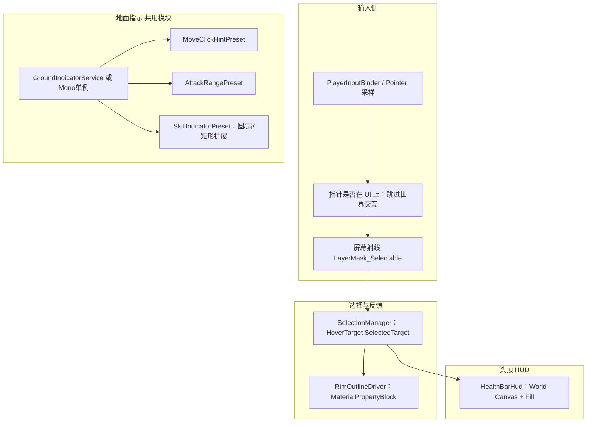

# 交互表现：悬停 Rim 描边、悬浮血条与地面范围提示 — 设计

| 项 | 说明 |
|----|------|
| 文档性质 | **架构与表现约定**：描边采用 **§3 Rim + MaterialPropertyBlock（方案 A）**；地面提示与攻击/技能范围 **共用同一套地面指示模块** |
| Unity 前置 | **URP**（或兼容 **SRP Batcher** 的 Lit 变种）；角色使用 **`NavMeshAgent`**；射线与 NavMesh **采样策略见 §7** |
| 与既有文档衔接 | **局内输入**见 [`局内输入与NewInputSystem接轨设计.md`](局内输入与NewInputSystem接轨设计.md)；**技能施法特效挂载**见 [`技能施法特效SkillCastVfx使用指南.md`](技能施法特效SkillCastVfx使用指南.md) — 本文为 **HUD/指示器**，与 **`SkillCastVfx`** **职责分离**（指示器≠技能释放粒子） |
| MVP 裁剪 | 可先做 **圆形线框 + 点击涟漪**；扇形技能为 **同一模块扩展形状** |

---

## 1. 设计目标

| 目标 | 说明 |
|------|------|
| **轻量** | 避免全屏 Outline 后处理；描边走 **顶点侧 Rim** + **材质参数**，地面提示走 **单实体 LineRenderer / 单 Mesh 条带**（二选一），控制 Draw Call |
| **可配置** | **悬停色 / 选中色 / Rim 强度** 可调；地面圆 **半径、颜色、线宽、虚实线** 由数据驱动 |
| **语义统一** | **普攻范围圆** 与 **技能指示圆** **同一 API**（半径与样式预设不同）；**点地导航提示** **仅生命周期与预设不同** |
| **可走区域一致** | 点地提示与 **`NavMeshAgent.SetDestination`** 使用 **同一 `NavMesh.SamplePosition` 结果**（见 **§7**） |

---

## 2. 模块划分与职责



### 2.1 职责边界（硬约束）

| 模块 | 负责 | **禁止** |
|------|------|----------|
| **`SelectionManager`** | 维护 **`HoveredUnit`**、`SelectedUnit`；派发 **`HoverChanged`** / **`SelectionChanged`**；协调 **仅一个** 「主 Hover」来源 | 在内部 **实例化技能粒子** |
| **`RimOutlineDriver`（单位侧）** | 缓存 **`Renderer[]`**（含 **`SkinnedMeshRenderer`**）；按状态写 **`MaterialPropertyBlock`**：`Rim Color / Rim Power / Rim Strength` 等约定参数名 | **每帧 `new Material`** |
| **`HealthBarHud`（单位侧）** | **World Space Canvas**（或 Billboard）；订阅 **`IDamageable`/`Health`** 数值变化刷新 **`fillAmount`** | 承担 **选中逻辑** |
| **`GroundIndicator`** | **`ShowCircle` / `Hide`**（扩展：`ShowSector`）；**优先级队列**（技能瞄准 > 普攻预览 > 点地昙花一现）或 **单一通道多参数覆盖** | 读取 **Buff  Opcode** |
| **`MatchHud`/`InspectPanel`** | 订阅 **`SelectionChanged`**，展示属性 | 射线投射 |

---

## 3. 悬停与选中：**Rim + MaterialPropertyBlock（方案 A）**

### 3.1 Shader 侧约定（实现者按 URP Shader Graph 或 HLSL）

在角色 **Base Map + Lighting** 之后增加 **Fresnel / Rim** 项，最小参数集：

| 参数（建议关键字） | 类型 | 说明 |
|--------------------|------|------|
| `_RimColor` | Color | **描边/发亮颜色**，与 **`SelectionManager`** 传入一致 |
| `_RimStrength` | Float | **0 = 关闭**，悬停为中档，选中为高阶（或由 `_RimPower` 一档完成） |
| `_RimPower` | Float | 边缘锐利度；**美术在 Prefab 默认上锁**，运行时少改 |

**顶点动画**：不要求；毕设 MVP **仅用视角相关 Fresnel** 即可显著「发亮」。

### 3.2 运行时写入策略

对每个 **`Renderer`**（`MeshRenderer`、`SkinnedMeshRenderer`）：

1. **`MaterialPropertyBlock` 实例**：**每个 `RimOutlineDriver` 组件一份**（或静态池 **禁止跨帧错乱**）；**不要在 `Update` 里 `new`**。
2. **`renderer.SetPropertyBlock(mpb)`**：对 **共享同一材质资产的多个网格** 仍 **逐 Renderer 生效**，互不污染材质资产。
3. **状态映射**：
   - **常态**：`_RimStrength = 0`（或极小环境 rim）。
   - **仅悬停**：`_RimColor = hoverTint`，`_RimStrength = hoverStrength`。
   - **选中**：`_RimColor = selectedTint`，`_RimStrength >= hoverStrength`（视觉更强）。
   - **选中且仍悬停**：二选一：**保持选中配色**（推荐，避免抖动）或 **插值**，文档层规定一种即可。

### 3.3 多网格与 LOD

- **初始化**：`GetComponentsInChildren<Renderer>(includeInactive: false)`，剔除 **不参与描边的 Renderer**（如纯阴影、遮挡用）可通过 **`[SerializeField]` 白名单 Layer 或命名后缀**。
- **LOD**：RimDriver 只处理 **当前可见 LOD 渲染器**；若切换 LOD，`OnBecameVisible` / 周期性刷新列表为 **P2**。

### 3.4 与非选中物体的关系

**防御塔 / 野怪 / 英雄** 使用 **同一 `RimOutlineDriver` Prefab 变体**，仅 **`hoverTint` / `selectedTint` ScriptableObject** 或 **`FactionOutlinePalette`** 不同（可选）。

---

## 4. 悬浮血条（World HUD）

### 4.1 层级结构（单位子节点）

```
UnitRoot
├── Model ...
└── HudAnchor（空物体：头顶偏移）
    └── Canvas (Render Mode = World Space)
        ├── HealthBar_Background (Image)
        └── HealthBar_Fill (Image, Type=Filled, Horizontal)
```

### 4.2 约束

| 项 | 约定 |
|----|------|
| **尺度** | Canvas `localScale` 统一（如 `0.01`），**局内镜头高度固定** 时无需每帧改 scale |
| **朝向** | MVP：**Billboard**（`LateUpdate` 中 `transform.forward = cam.transform.forward`），或 **固定俯视** 下仅绕 Y 轴对齐相机 |
| **排序** | **`Canvas.sortingOrder`** 略高于地面贴花；**同屏多单位** 用 **不同 offset** 减少 Z-fight（可选） |
| **数据** | **`HealthBarHud`** 引用 **`IReadOnlyHealth`** 或 **`Health` 组件**；**仅数值变化** 时改 UI，**不在 Update 轮询字符串** |

### 4.3 可选显示策略

- **仅选中或悬停显示血条**：由 **`SelectionManager`** 广播状态，`HealthBarHud` 切换 **`Canvas.enabled`** — 更干净，也更省 Overlay。
- **始终显示**：MOBA 常见；毕设任选，文档实现与之一致即可。

---

## 5. 地面指示：**共用模块 `GroundIndicator`**

### 5.1 统一数据模型

| 字段 | 说明 |
|------|------|
| **`presetId`** | `MoveClick`、`AttackRange`、`SkillCircle`、`SkillSector`… |
| **`center`** | 世界坐标；**Y** 来自 **§7 NavMesh / 射线贴地** |
| **`radius` / `innerRadius`** | **攻击/技能圆**共用 **`radius`** |
| **`heading`** | **扇形技能**：`forward` 在 XZ 平面投影归一化 |
| **`sectorAngleDeg`** | 扇形角度；圆模式忽略 |
| **`color` / `lineWidth`** | 美术与玩法可读配置 |
| **`duration`** | **`float.MaxValue`** 表示持续到 **`Hide`**；点地常为 **0.35～1.0s** |

### 5.2 实现选项（毕设选一种写死）

| 方案 | 优点 | 注意 |
|------|------|------|
| **`LineRenderer` 闭环** | 实现快，**改半径** 重生点列即可 | **段数** 固定（如 48～64）控制开销 |
| **单 Mesh 圆环条带 + 动态 `Mesh.vertices`** | Draw Call **更可控**（单 mesh） | **扇形** 与 **圆** **共用拓扑生成函数** |

### 5.3 显示优先级（避免叠套）

在同一帧只允许 **一类「主地面指示」** 占满 **`GroundIndicator` 可视化通道**，建议顺序：

1. **技能瞄准中**（按下技能槽位且未落地确认）→ 显示 **技能形状**。
2. 否则若有 **普攻范围预览按键/状态** → **攻击范围圆**。
3. 否则若 **刚刚点地成功** → **移动提示**（短生命周期，可与 2 **短暂共存**时可分 **双色线宽**，MVP **建议互斥**）。

**API 草稿**：

```
GroundIndicator.PushOrReplace(request)   // 带 priority
GroundIndicator.HidePreset(presetId)
GroundIndicator.HideAll()
```

---

## 6. 攻击范围提示

| 项 | 约定 |
|----|------|
| **圆心** | **当前可操作英雄** **`transform.position`**；**斜坡** 时 **§7 `SamplePosition` 对齐 NavMesh** 表面 |
| **半径** | **`CombatStats` / SO** 上的 **`attackRange`**（或与普攻逻辑 **同一数据源**，禁止 UI 自创常数） |
| **启用条件** | **按住快捷键**或 **普攻键处于「预览」状态**（与输入文档 **Battle Map** **对齐**）；**松开即 `Hide`** |
| **与选中关系** | 若设计为「仅当选中己方英雄时预览」，则由 **`SelectionManager.SelectedUnit == localHero`** 门卫 |

---

## 7. 点地导航：范围提示 + NavMeshAgent

```
过程 OnGroundClick(screenPos):
    若 EventSystem 指针在 UI 上: 返回
    ray = Camera.ScreenPointToRay(screenPos)
    若 !Physics.Raycast(ray, hit, ...) : 返回
    若 !NavMesh.SamplePosition(hit.point, NavMeshHit out, sampleMaxDist, walkableMask): 返回  // 失败可不画圈
    agent.SetDestination(hitNav.position)
    GroundIndicator.ShowMovePing(center: hitNav.position, preset: ..., duration: 0.5)
```

**`sampleMaxDist`**：与 **`NavMeshAgent` 障碍物容差** 同量级可调（如 `0.5～2m`）。

---

## 8. 技能指示（共用 `GroundIndicator`）

| 项 | 约定 |
|----|------|
| **数据源** | **技能静态配置**：`indicatorRadius`、`sectorAngle`、`maxCastRange`、`shape` |
| **圆** | **`ShowCircle`**，与普攻 **调用同一生成函数**，**仅预设颜色/线型不同** |
| **扇形** | **`ShowSector(center, radius, heading, angleDeg)`**；**朝向**取 **摄像机射线与 Y=常量平面交点 − 英雄 XZ**，再归一化（与 RTS/MOBA 习惯一致） |
| **生命周期** | **`TryBeginCast` 进入瞄准** → **`Push` skill preset**；**Confirm / Cancel** → **`HidePreset(Skill)`** |
| **与技能粒子** | **指示器** 仅 **地面线框**；**读条/法阵粒子** 仍走 **`SkillCastVfx`**（避免职责混淆） |

---

## 9. 输入、射线与 Layer

| Layer / Mask | 用途 |
|--------------|------|
| **`Selectable`** | **英雄 / 野怪 / 塔** Collider；**悬停与左键选中** 射线 **仅打此层**（或 **Default + 排除** 地形，二选一以项目为准） |
| **地形** | **点地** 射线 **命中层**；与 Selectable **分序**：可先 **Selectable**，未命中再 **地形**（避免「点怪脚底下误点地」— 由 **碰撞体高度/厚度** 调整） |

**与 UI 互斥**：任何 **世界交互** 前执行 **`EventSystem.current.IsPointerOverGameObject()`**（或 Input System 等价），**为 true** 则 **不更新 Hover、不点地、不取消技能**（最后一条按你们 UI 规则微调）。

---

## 10. 事件与属性面板（摘要）

| 事件 | 载荷 | 订阅方 |
|------|------|--------|
| **`HoverChanged`** | `EntityHandle? prev, EntityHandle? next` | `RimOutlineDriver`（旧/新）、可选 `HealthBarHud` 显隐 |
| **`SelectionChanged`** | `EntityHandle? selected` | **属性 Inspect 面板**、**攻击范围数据来源**（若绑定选中单位） |

**载体**：`EntityHandle` 或 **`NetworkId`/`EntityId`** 与本项目 ECS 对齐；正文不绑定具体命名空间。

---

## 11. 验收清单（毕设自检）

| # | 项 |
|---|-----|
| 1 | **悬停** 仅 **Selectable** 出现 Rim，离开后恢复 |
| 2 | **选中** Rim **强于悬停**，**颜色可辨** |
| 3 | 血条 **数值与战斗扣血同步**，无 GC 抖动（MPB/UI 分批刷新） |
| 4 | **点地** 圈心在 **`SamplePosition`** 成功点，Agent **到达一致** |
| 5 | **技能圆** 与 **普攻圆** **同一 `GroundIndicator` 调用路径**，配置文件 **仅半径不同** |
| 6 | 指针在 **上层 UI** 时 **不产生世界 Hover/点地** |

---

## 12. 修订记录

| 版本 | 日期 | 摘要 |
|------|------|------|
| 1.0 | 2026-05-07 | 初稿：Rim 方案 A、血条、共用地面指示、NavMesh 点地、与输入/UI 边界 |

---

## 13. 工程实现索引（`Gameplay.Presentation.Interaction`）

以下脚本位于 `Assets/_Project/Code/Scripts/Presentation/Interaction/`，与上文模块对应；需在 Unity 内完成 **Shader Rim 参数**、**LineRenderer 材质**（若需）、**Scene 挂载 / Layer** 与 **`Canvas` Prefab** 拼装。

| 设计章节 | 脚本 / 类型 |
|----------|-------------|
| §3 Rim 参数名 | `RimPresentationShaderIds` |
| §3 调色板（资产） | `OutlinePresentationPalette`（`CreateAssetMenu`） |
| §3 单位侧 Rim | `RimOutlineDriver`，`PresentationRimVisualKind`、`PresentationRimVisualPlanner` |
| §9 可选中根解析 | `SelectablePresentationResolve` |
| §10 悬停/选中 | `PresentationSelectionHub`（`HoverChanged` / `SelectionChanged`，`RefreshRimVisuals()`） |
| §5 请求与优先级 | `GroundIndicatorRequest`、`GroundPresentationPresetKind`、`GroundPresentationPriority` |
| §5 地面线框 | `GroundWorldLineIndicator`（`PushOrReplace` / `PushMovePing` / `PushAttackRangeCircle` / `PushSkillCircle` / `PushSkillSector`） |
| §7 NavMesh 投影 | `NavMeshPointPresentation` |
| §9 UI 挡射线 | `UiPresentationPointerGate` |
| §4 血条 Billboard / 填充 | `WorldBillboardHudPresenter`、`WorldHealthFillPresenter` |
| §4.3 血条显隐 | `WorldHealthBarPresentationFocusGate` |

**仍为 Editor/场景工作项**：角色材质使用与 `_RimColor` / `_RimStrength` / `_RimPower` 同名的 Shader Graph 属性；场景中放置单个 `PresentationSelectionHub`、一个子物体挂 `GroundWorldLineIndicator`；`LineRenderer` 默认值可运行，若线不可见再赋 `Sprites-Default` 等材质；输入层在左键点选时调用 `TryCommitSelectionUnderScreenPoint`，点地/技能再调 `GroundWorldLineIndicator` 与 `NavMeshPointPresentation`。
