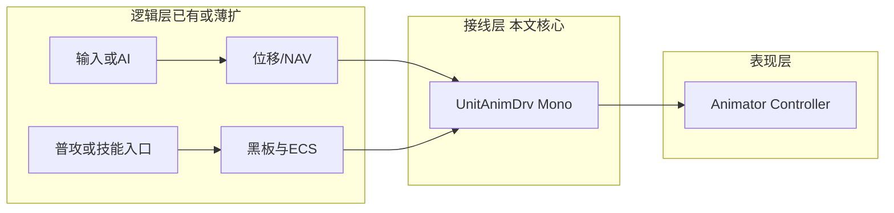

# 局内人物动画与战斗操作对接 — 毕设极简设计

| 项 | 说明 |
|----|------|
| 目标读者 | 毕业设计答辩 + 单人维护：方案要**少类、少状态、易画图讲清** |
| 与仓库关系 | **不替代** ECS/Impact/黑板/技能管线；本文只描述 **`EntityBase` 表现层（Mono + `Animator`）** 如何**读逻辑、写参数** |
| Unity 侧前提 | 已为角色配置 **`Animator` + `Animator Controller`**（Idle / Move / Attack / Death 等状态与过渡） |

---

## 1. 设计目标

| 目标 | 说明 |
|------|------|
| **分离职责** | **战斗真相**仍在 ECS/组件/黑板/Impact；动画只表达**当前想给人看的状态** |
| **极小接线面** | 每个可动单位**一个**「动画驱动」脚本 + **少量** Animator 参数；避免再建一套与 ECS 平行的 FSM |
| **易懂** | 答辩可画一张图：**命令/黑板 → 驱动器 → Animator**；不讲 Playables、不讲网络同步 |

---

## 2. 总体架构（三层）

**原则**：

- **`ImpactSystem`、`UnitVitalitySystem`** 等 **不引用 `Animator`**。
- 动画脚本 **只订阅**「本单位」上**已发生**或**易推导**的事实：速度、是否在打、是否死亡等。

---

## 3. 极简 Animator 参数约定（建议）

毕设建议 **4～6 个参数** 封顶；表内为推荐名，可与 Controller 里实际名一致。

| 类型 | 名称（示例） | 含义 |
|------|----------------|------|
| `float` | **`MoveSpeed` 或 `Speed`** | 水平速度模长；**0≈Idle，>小阈值→Move**（Controller 里用 Transition 阈值） |
| `bool` | **`IsGrounded`** | 若不做跳跃可**写死 true** 或省略 |
| `trigger` | **`Attack`** | **普攻**开始时 **SetTrigger** 一次 |
| `trigger` | **`Skill`**（可选） | 技能表现与普攻分轨时用；极简可 **`Attack` 共用** |
| `bool` | **`IsDead`** | **击倒为 true**，且过渡后 **勾选不可再切回 Idle** |

**不立**复杂的 `CombatState` 枚举去驱动几十条边：能用 **`Speed + Attack Trigger + IsDead`** 就不增加第三维。

---

## 4. 与各操作的连接（谁写参数）

### 4.1 移动

| 数据源 | 驱动器如何做 |
|--------|----------------|
| **`CharacterController`** / **`Rigidbody.velocity`** / **NavMeshAgent.velocity**（三选一） | 每帧在 **`LateUpdate`** 或 **`Update` 末尾** 读 **`transform` 或 Agent 的水平速度**，赋 **`Animator.SetFloat("Speed", planarMagnitude)`** |
| **根位移**（毕设一般关） | 仍用逻辑位移；动画只做 **原位循环** |

**极简**：若没有 NAV，仅用「目标点向量」移动，则用 **`desiredVelocity.magnitude`** 或 **`hasPath ? speed : 0`**。

### 4.2 普攻（与现有链路对齐）

当前工程普攻逻辑侧典型路径：**黑板 Strike** → **`DefaultCombatImpactDispatch`** 投递 Impact。

推荐 **两种**接轨方式（二选一即可）：

| 方案 | 做法 | 工作量 |
|------|------|--------|
| **A. 编排器调用顺序（最简）** | 在**当前**发起普攻的代码里（如 Debug 桥、输入回调）：**先** `animator.SetTrigger("Attack")`，**再**（同一帧或晚 **0.1～0.2s `Invoke`/`Coroutine`）调用 **`TryDispatchNormalAttack`** | 不写事件，**易产生「挥空也播」**，毕设够用需口头说明假设 |
| **B. Dispatch 成功后播（稍加严）** | 封装 **`TryCommitNormalAttack(attacker)`**：内在先校验 Dispatch，**成功**再 `SetTrigger("Attack")` | **推荐**，与「先有合法目标再打」一致 |

**伤害对齐时刻（极简）**：

- **首推**：在 **Attack 动画剪辑**上打 **`Animation Event`**，调用 **`AnimEvt_Strike`**（宿主 **`UnitAnimDrv`**），只对 **本单位** 出伤；  
- **备选**：Attack 开始后 **固定延时**调用 Dispatch（不写 Event，调一次 `Invoke`）。

**不要求**第一段就把 **网络预测**做进 Animation。

### 4.3 技能

| 数据源 | 驱动器如何做 |
|--------|----------------|
| **`SkillExecutionFacade.TryBeginCast`** 成功后 | 在进入管线处 **`SetTrigger("Skill")`**（或与 Attack 共用） |
| 多段技能 | 毕设可 **只做一段起手动画**；段间由 **Timeline** 或第二 Trigger 属 **P1** |

技能实际伤害仍走 **Buff/Opcode/Impact**，动画只负责**看得像在施法**。

### 4.4 受击（可选）

| 做法 | 说明 |
|------|------|
| **极简版** | **不做** Hit 动画，仅 **血条/UI 抖一下** |
| **加一项** | `CombatBoard` 或 Impact 结算后 **`OnDamaged`**：`SetTrigger("Hit")`（短时回到 Locomotion） |

若加受击 Trigger，须在 Controller 里设 **可从 Any State 打断**或短过渡，否则易卡死。

### 4.5 死亡（与现有击倒事件对齐）

| 数据源 | 驱动器如何做 |
|--------|----------------|
| **`UnitDeathEventHub`** 或 **`CombatUnitDiedGameEvent`**（`victimEntityId == 本单位 ECS Id`） | **`Animator.SetBool("IsDead", true)`**；可选 **关掉 `Collider`/`Nav`** 由同监听或延迟一帧执行 |

监听已写在 **`UnitAnimDrv`** 里 **订阅静态事件**，**`OnDisable`/`OnDestroy`** 生命周期内随组件禁用取消订阅。

---

## 5. 建议类职责（单机文件即可）

建议新增 **`UnitAnimDrv`** Mono（已实现，命名空间 **`Gameplay.Presentation`**）：

| 职责 | 非职责 |
|------|--------|
| 缓存 **`Animator`**、`EntityBase`（若有） | 不写伤害公式、不写索敌 |
| 每帧更新 ** locomotion ** 参数 | 不把 Impact 搬进 Animator |
| 提供 **`BeginNormalAttackSwing()`** / **`NotifySkillCastStarted()`** / **`AnimEvt_Strike`** 等入口 | 不接 UNet |
| （可选）订阅死亡事件 **`SetBool IsDead`** | 不修 NavMeshBake |

必要时可把 `SetTrigger` 写在现有 **`MvpHeroBasicAttackDebugBridge`**——现在已改为 **`UnitAnimDrv`**。

---

## 6. 与现有模块的衔接点（仓库内检索用）

| 现有能力 | 动画层可挂接方式 |
|-----------|------------------|
| **`EntityBase` + `BoundEcsEntity`** | 死亡事件里比对 **victim id** |
| **`CombatBoardLiteComponent` / `DefaultCombatImpactDispatch`** | 与 **普攻**同一时刻或 **Animation Event** |
| **`SkillExecutionFacade`** | `TryBeginCast` 成功分支里 **Trigger Skill** |
| **`UnitDeathEventHub` / `CombatUnitDeathRelay`** | **IsDead** |

---

## 7. 分阶段实施（控制毕设工作量）

| 阶段 | 内容 | 答辩可展示 |
|------|------|------------|
| **P0** | **Speed** + **Attack Trigger** + **Dispatch（Event 或延迟）** + **IsDead** | 走、打、死 |
| **P1** | **Skill Trigger**、简单 **Hit**（Animator + `IUnitHpBarFeedback`） | 技能与受击 |
| **P2** | 上下身 Layer、Blend Tree | 属加分项，非必须 |

---

## 8. 明确不做的项（防范围膨胀）

- **不在 Animator 里驱动根位移**（除非单独开题做 Locomotion 论文）。  
- **不把 ECS System 改成每帧扫 `Animator`**。  
- **不做完整 Locomotion 八向 blend**（除非资源已自带）。  
- **第一版不做** 动画与 **Mirror 网络** 的精确同步（可用「逻辑状态同步 + 本地Animator」口头说明局限）。

---

## 9. 实现对照（仓库脚本）

| 脚本 | 说明 |
|------|------|
| **`Gameplay.Presentation.UnitAnimDrv`** | 移动 **Speed / IsGrounded**，普攻 **`BeginNormalAttackSwing`** → **`AnimEvt_Strike`** → **`TryDispatchNormalAttack`**；Fallback 可调；**`NotifySkillCastStarted`** / **`NotifyDamaged`**；订阅 **`UnitDeathEventHub`** 设 **`IsDead`** |
| **`HitFxRelay`** | **`ImpactSystem`** 扣血后调 UI/受击 |
| **`IUnitHpBarFeedback`** | UI 血条挂载实现 **`OnHpDamagedShake()`**，拖入 **`UnitAnimDrv`** 的 **hpBarFxHost** |

---

## 10. Unity Editor 最小要做的事

以下与 **§3** 参数名、`UnitAnimDrv` 默认值一致；Prefab 指带 **`EntityBase`** 的英雄（或等价宿主）。

1. **Prefab 上挂 `Animator`**  
   - 指定 **`Animator Controller`**，内含 **Idle / Move / Attack /（可选）Skill / Death /（可选）Hit** 等状态与过渡。  
   - Controller 内声明与 **`UnitAnimDrv` Inspector** 一致的参数（默认 **`Speed`** Float、**`IsGrounded`** Bool、**`IsDead`** Bool、**`Attack` / `Skill` / `Hit`** Trigger）。若改名，在 **`UnitAnimDrv`** 面板里同步改参数字段。

2. **挂载 `UnitAnimDrv`**  
   - 与 **`EntityBase`、Animator 同物体**，或挂在 **`EntityBase` 根物体**（脚本会 **`GetComponent`** / **`GetComponentInChildren<Animator>()`** 解析）。  
   - 若用 **NavMeshAgent / Rigidbody / CharacterController** 之一驱动位移，拖到对应槽位；留空则 **`Speed` 恒为 0**（仅演示站桩普攻亦可）。

3. **普攻出伤与动画对齐**  
   - 在 **Attack 动画剪辑**中打开 **Animation Event**，在挥击落点帧添加事件，函数选 **`UnitAnimDrv.AnimEvt_Strike`**（无参）。  

4. **暂不做 Animation Event 时**  
   - 在 **`UnitAnimDrv`** 上将 **`strikeFallbackDelaySeconds`** 设为 **`0.2`**（或类似小数秒），用于**延迟一次**自动出伤占位；正式仍建议改回 **事件落点**。

5. **技能表现**  
   - 代码已由 **`SkillExecutionFacade.TryBeginCast`** 在管线启动成功后调用 **`NotifySkillCastStarted()`**，**Controller 里接住 `Skill` Trigger** 即可；**无需**在 Editor 额外绑定技能线。

6. **血条/UI 受击反馈（可选）**  
   - 另写一 **`MonoBehaviour`**，实现 **`IUnitHpBarFeedback`**（ **`OnHpDamagedShake()`** 内做血条抖动、闪白等）。  
   - 将该组件**拖入 **`UnitAnimDrv` 的 `hpBarFxHost`** 槽位。  
   - 不拖时：**仍会** 由 **`HitFxRelay` → `NotifyDamaged`** 播 **`Hit`** Trigger，仅无 UI 抖动。

---

## 11. 文档修订记录

| 版本 | 日期 | 说明 |
|------|------|------|
| 1.2.0 | 2026-04-18 | 新增 **§10 Unity Editor 最小要做的事**；补足 **§9** 标题。 |
| 1.1.0 | 2026-04-18 | 补充实现：`UnitAnimDrv`、动画事件名 **`AnimEvt_Strike`**、`HitFxRelay` / **`IUnitHpBarFeedback`**。 |
| 1.0.0 | 2026-04-18 | 初稿 |

---

## 12. 相关文档

- `工程模块与命名空间-现行实现总览.md` — 战斗与 ECS 入口  
- `MOBA普攻与瞬时伤害Impact投递-设计与阶段计划.md` — 普攻与黑板叙事  
