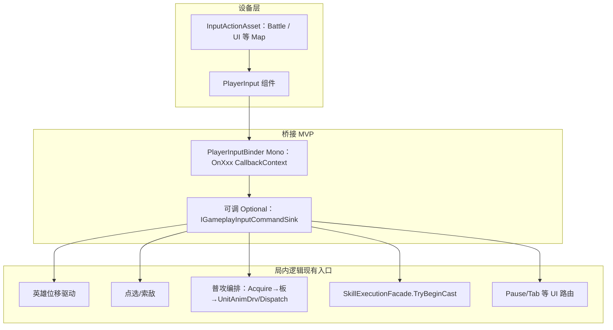

# 局内输入与 Unity Input System 接轨 — 设计

| 项 | 说明 |
|----|------|
| 文档性质 | **架构与衔接约定**；不要求一次性替换工程中全部 `Input.Get*` |
| Unity 前置 | [**Input System**](https://docs.unity3d.com/Packages/com.unity.inputsystem@latest) 包已启用；**Project Settings → Active Input Handling** 常为 *Both* 或 *Input System Package* |
| **MVP 已定** | **`PlayerInput`** + **单机 Binder**（脚本名自定，下文以 **`PlayerInputBinder`** 为例）：离散输入用 **`void OnXxx(InputAction.CallbackContext ctx)`** 订阅 **`performed`/`started`**；**`Move`** 连续量见 **§4.4（轮询）**。Binder **不限于战斗**，同一组件可挂载 **普攻/技能** 与 **`Pause`/菜单路由** 等 Action。 |
| 工程现状 | 仍有 **Legacy `Input`**（`MvpHeroBasicAttackDebugBridge`、`CombatBoardRaySelectTarget`）；迁移路径见 **§7** |

---

## 1. 设计目标

| 目标 | 说明 |
|------|------|
| **单一读入面** | 设备映射**收口到 `PlayerInput` 绑定的 `InputActionAsset`**；业务只看见 Binder **转手的命令或每帧位移向量** |
| **可测试** | 可把 **Acquire→Strike** 抽到无 Input 的类型后，Binder 仅薄薄一层 **`OnAttack` → RequestStrike** |
| **与现有链路兼容** | **`SkillExecutionFacade`**、**黑板**、**`UnitAnimDrv`**、**`DefaultCombatImpactDispatch`** 等 **不依赖** `UnityEngine.InputSystem` 命名空间 |
| **毕设可裁剪** | MVP 可只做 **键盘 + 鼠标**；**手柄/重绑定**为 P1 |

---

## 2. 分层模型（推荐）



### 2.1 各层职责（硬边界）

| 层 | 做什么 | 禁止做什么 |
|----|--------|------------|
| **Input Actions** | 映射 **Move / Attack / SkillSlots / Point / Confirm / Cancel**；含 **Dead Zone、Press/Release** | 引用 **`EntityBase`**、**调 `TryBeginCast`** |
| **Binder（`PlayerInputBinder` + `OnXxx(...)`）** | **`OnEnable`**：按需在资产里 **`Enable` 多个 Map**（典型：**`Battle`** 局内移动/战斗；**`UI`** 或专用 Map 承载 **`Pause`/菜单**）。各 Map 内离散 Action：**`performed += OnXxx`**（§4.2）；**`Move`**：§4.4 **`Update`** 轮询 **`ReadValue&lt;Vector2&gt;`**；**`OnDisable`**：**`-=` 注销**。可序列化 **`EntityBase`** / 注入战术 Routine。 | **禁止**：Binder 内 **绕过既有 Facade/API** **手写 Impact 或黑板内核**。 |
| **局内逻辑** | 与现有一致：**位移**改 `Transform`/`CharacterController`；**普攻**走 **`MvpHeroBasicAttackDebugBridge` 同类 API** 或抽出的 **`INormalAttackCommand`**；**技能**只调 **`SkillExecutionFacade`** | 出现 **`Keyboard.current`** 散落 |

---

## 3. Input Actions 资产约定（逻辑名，非具体绑定）

建议 **Action Map：`Battle`**（局内），与 UI 用 **`UI`** Map 分离（避免与 **EventSystem** 抢焦点时的误触）。

| Action（逻辑名） | 类型 | 典型绑定 | 消费方 |
|------------------|------|----------|--------|
| **`Move`** | `Vector2` | WASD / 左摇杆 | 英雄位移脚本 |
| **`Look`** | `Vector2` | 鼠标 Delta / 右摇杆 | 相机（若第三人称） |
| **`Point`** | `Vector2` | 鼠标位置 | UI 射线 / 与 `CombatBoardRaySelectTarget` 同源策略 |
| **`Attack`** | `Button` | 鼠标左键 / J / X | 普攻编排（近敌 / 板提示二选一可拆两个 Action） |
| **`Skill1`…`Skill4`** | `Button` | 数字键 / 肩键 | **`TryBeginCast(skillId, context)`** |
| **`Cancel`** | `Button` | Esc / B | 取消施法/关闭面板（P1） |
| **`Pause`** | `Button` | Esc（与 UI 策略二选一） | **UI 状态机** |

**普攻**：若保留 **「空格近敌 + Enter 板提示」**，可做成 **`AttackPrimary` / `AttackSecondary`** 两个 Button，桥接层分别调用现有 **`TrySwingNearest` / `TrySwingBoardHint`** 等价逻辑（实现时是否复用 `MvpHeroBasicAttackDebugBridge` 见 §6）。

---

## 4. MVP 实现：`PlayerInput` + Binder，及 `OnXxx(InputAction.CallbackContext)`

本仓库 **MVP** 采用：**场景里放一个 `PlayerInput`**（引用 **`.inputactions`** 生成的 **`InputActionAsset`**），**再在自身或同级物体挂载 Binder**（下文示例名 **`PlayerInputBinder`**）。Binder 内部用 **`void OnXxx(InputAction.CallbackContext ctx)`** 作为 **离散输入回调**；**不与 `UnityEngine.Events.UnityAction`/`SendMessage`** 耦合，便于跳转定义与 **`OnDisable` 成对 `-=`**。**暂停菜单、Cancel 等与战斗同属 Binder 的职责拆分**，仅用 **Action Map** 分层（§3），不必再拆第二个「仅限战斗」脚本名。

---

### 4.1 Inspector 侧（与 `PlayerInput` 对齐）

| 字段 / 选项 | 建议 |
|-------------|------|
| **Actions** | 指向 **`InputActionAsset`**（含 **`Battle`** 及 **`UI`/菜单** 等 Map，按 §3） |
| **Default Action Map** | 进入局内常为 **`Battle`**；Binder **`OnEnable`** 可再 **`Enable`** 所用 Map（含 **`Pause` 所在 Map**），避免遗漏。 |
| **Behavior** | Binder **仅用** **`playerInput.actions` + 代码 `+=/-=`**，**不依赖** **`PlayerInput` 的 SendMessage / `OnFire` 字符串** 路由。Inspector 里 **Behavior** 可与团队模板一致；**勿再挂一套按方法名自动调用的脚本**。 |
| **同一宿主** | **`PlayerInput`** 与 **`PlayerInputBinder`** 同物体时：**`GetComponent<PlayerInput>().actions`** 最简。 |

---

### 4.2 订阅模式：**显式 `performed += OnXxx`（主推）**

- **为什么在 MVP 首推**：  
  - 方法签名 **固定 `InputAction.CallbackContext`**，与教材/官方示例一致；  
  - **生命周期清晰**：**`OnEnable`** 绑定、**`OnDisable`** 解除，避免 **重复订阅 / 对象销毁后仍回调**。  
  - 不依赖 **`PlayerInput` Messages** 所需的 **方法字符串命名**，重构友好。
- **做法**：缓存 **`InputAction`** 引用（或每次 **`FindAction`**），对每个 **Button**/离散：**`atk.performed += OnAttack`**。  
  ```csharp
  // 语义骨架（命名空间实现时按项目拆分）
  void OnEnable()
  {
      var p = playerInput != null ? playerInput : GetComponent<PlayerInput>();
      var battleMap = p.actions.FindActionMap("Battle");
      battleMap.Enable();
      // 若 Pause 等在 UI Map：另行 FindActionMap("UI").Enable() 并 += OnPause ...
      _attack = battleMap.FindAction("Attack");
      _skill1 = battleMap.FindAction("Skill1");
      if (_attack != null) _attack.performed += OnAttack;
      if (_skill1 != null) _skill1.performed += OnSkill1;
  }

  void OnDisable()
  {
      if (_attack != null) { _attack.performed -= OnAttack; _attack = null; }
      if (_skill1 != null) { _skill1.performed -= OnSkill1; _skill1 = null; }
  }

  void OnAttack(InputAction.CallbackContext ctx)
  {
      // 已挂在 performed 上时 ctx.phase 即为 Performed；若改绑 started 再分支
      // → RequestNormalAttackNearest() 等局内 Routine
  }
  ```

---

### 4.3 `CallbackContext` 使用约定（毕设够用）

| 场景 | 建议 |
|------|------|
| **单击 / 开火式 Button** | 主听 **`performed`**；防抖放在 **Routine 内部** 或简单 **CD 字段**。 |
| **长按** | **`started`/`canceled`** 与 **Repeat Interaction**；MVP **可不做**。 |
| **UI 独占时** | 全屏菜单：将 **局内 `Battle` Map `Disable()`**（或整体 **`PlayerInput.DeactivateInput()`**）；关闭再 **`Enable()`** / **`ActivateInput()`**。 **`UI` Map** 可按需与之切换。 |
| **`ctx`** 不写业务 | **`ctx` 只用来做 phase/时间戳**，**不向下传递**给 Impact 层 |

---

### 4.4 **例外：`Move` 不按帧 `OnMove`——用 `Update` 轮询**

- **原因**：向量型 **`Move`** 若绑 **`performed`**，对不同 **Interactions**（**Pass Through / Press**）时序与手柄噪声处理不如 **`ReadValue` 直观**。  
- **约定**：**`OnEnable`** 缓存 **`_moveAction = map.FindAction("Move")`**；在 **`Update`/`FixedUpdate`** 中 **`var v = _moveAction.ReadValue&lt;Vector2&gt;()`**，交给 **`HeroLocomotor`**（或等价组件）。  
- **若坚持 `CallbackContext`**：可用 **`started`/`canceled`** 归零、**或** **`OnMove(InputAction.CallbackContext ctx)` + `ReadValue`** 在每帧 **`performed`** 连续触发时同步读——仍可接受，但以 **§4.4 第一句**为准。

---

### 4.5 备选方案（弱化书写，仅占位）

| 方案 | 何时考虑 |
|------|----------|
| **`PlayerInput` + SendMessages / Inspector UnityEvent** | 仅 **Jam/一天内接线** prototype；与本 MVP **二选一**。 |
| **无 `PlayerInput`，自持 `InputActionAsset.Enable`** | 多 **`InputUser`**、分客户端设备；单机毕设 **非必须**。 |

---

## 5. 与现有代码的接轨点（按功能）

### 5.1 射线点选黑板

- **现状**：`**CombatBoardRaySelectTarget`** 使用 **`Input.GetMouseButtonDown(0)`**。  
- **目标**：**Input System** **`Point`（Screen 坐标） + `Click`/`Attack` performed** → 调用与现逻辑等价的 **`ScreenToRay`** + **`MeleeStrikeRules` + `SetAttack…`**  
- **做法**：抽出 **`CombatBoardPointerSelect.TrySelectFromScreen(Vector2 screen, Camera cam)`** 静态或实例方法，`Legacy`/`New` 两处薄封装 —— **二选一**，避免复制粘贴大块逻辑。

### 5.2 普攻

- **现状**：`**MvpHeroBasicAttackDebugBridge`**：`Input.GetKeyDown`。  
- **目标**：**`Attack`** Action **`performed`** → 调用 **同一套**：**Acquire → `CombatBoardTargetSync` → `UnitAnimDrv.BeginNormalAttackSwing`**（无驱动则 Fallback Dispatch）。

### 5.3 技能

- **现状**：仅靠其它脚本 **`TryBeginCast`**。  
- **目标**：**`Skill1.performed`** → 组装 **`SkillCastContext`**（**Caster=`EntityBase`**，**PrimaryTarget** 取自黑板或由点选脚本缓存）→ **`SkillExecutionFacade.TryBeginCast(skillId, context, out err)`**（**`skillId`** 可由 **`SerializeField int[]`** 或 **`ScriptableObject` 表**）。

### 5.4 位移

- **现状**：工程中若尚无统一英雄移动，可增加 **`HeroLocomotor`**：由 **`PlayerInputBinder`** 按 **§4.4** 每帧读 **`Move.ReadValue<Vector2>()`**，再 **`CharacterController.Move`** 或改 **`Rigidbody.velocity`（俯视）**。  
- **与动画**：**`UnitAnimDrv`** **读位移组件速度**即可，Input 不解 **`Animator`**。

### 5.5 UI（血条、菜单）

- **`IUnitHpBarFeedback`** 等 **不写 Input**；**Pause** 仅需 **UnityEngine.EventSystems** / **UGUI** 焦点策略。  
- **规则**：局内 **`Battle`** Map 开启时，`UI` Map 可选用 **低频 Action**（如 **Pause only**），其它 **导航**仅在 **`UI`** Map **Enable** 时活跃。

---

## 6. 接口草图（语义级，非定稿 API）

为避免 **ECS/Core** 依赖 Input 包，建议接口落在 **`Gameplay.Input`**（或按模块再分子命名空间）：

```csharp
// 语义示例：可由 Binder 调用，或由测试 Fake 实现。（战斗 + 菜单可由不同方法或拆分接口）
public interface IGameplayInputCommandSink
{
    void RequestNormalAttackNearest();
    void RequestNormalAttackFromBoard();
    void RequestSkill(int slotIndex); // slotIndex → SkillId 在 Binder 映射
    void RequestTogglePauseMenu();    // Esc / Pause Action → UI 状态机
}

// 或：每秒由 Locomotor 轮询。
public readonly struct GameplayLocomotionIntent
{
    public readonly Vector2 MovePlanar;
}
```

**普攻桥**可把 **`MvpHeroBasicAttackDebugBridge`** **内部私有方法**抽到 **`HeroNormalAttackRoutine`** **静态工具类**，**Binder**、**Legacy Debug** **共用**，减少双轨维护。

---

## 7. 迁移策略（Legacy → Input System）

| 步骤 | 工作 |
|------|------|
| **0** | 安装 Input System，`Active Input Handling = Both`，先不删 **`Input`**。 |
| **1** | 场景中 **`PlayerInput` + `.inputactions` 资产**，挂 **`PlayerInputBinder`**（或等价 Binder），**Legacy 与新版键位可先错开**（`Both` 模式）。 |
| **2** | 将 **`CombatBoardRaySelectTarget`、`MvpHeroBasicAttackDebugBridge`** **逐文件**改为 **可调用的无 Input 内核**；外壳仅 **Binder**。 |
| **3** | Scene 验收后，`Both` → **`Input System Package Only`**（可选）。 |

---

## 8. 明确不纳入第一版的事项

- **局域网联机输入权**（谁拥有 **`InputUser`**）  
- **完整的 Input Rebinding UI**（可用默认绑定即可答辩）  
- **触屏虚拟摇杆**（若 Demo 仅用 PC）  
- **InputBuffer**、**预输入队列**（格斗级；MOBA毕设省略）

---

## 9. 相关文档 / 脚本

| 文档/脚本 | 关系 |
|-----------|------|
| `局内人物动画与战斗操作对接-毕设极简设计.md` | 动画 **`UnitAnimDrv`** 仍由逻辑层触发，不因 Input 重写 |
| `MOBA普攻与瞬时伤害Impact投递-设计与阶段计划.md` | 普攻真相仍在黑板与 Impact |
| `MvpHeroBasicAttackDebugBridge` | 迁移时拆 **「无 Legacy API 的核心调用」** |
| `CombatBoardRaySelectTarget` | 鼠标 → **`Point`** + **`Click`** |
| `SkillExecutionFacade` | 技能触发唯一点 |

---

## 10. 修订记录

| 版本 | 日期 | 说明 |
|------|------|------|
| 1.2.0 | 2026-04-17 | Binder 示例名由 **`BattleInput`** 调整为 **`PlayerInputBinder`**：**同一 Binder** 覆盖 **战斗 + `Pause`/菜单** 等；§2 / §6 接口与 **Map 分层**措辞对齐。 |
| 1.1.0 | 2026-04-18 | **MVP 定稿 `PlayerInput` + Binder**；重写 **§4**（`**performed += OnXxx`**、**Move 轮询**、备选降级）；对齐 **§7** 步骤用词。 |
| 1.0.0 | 2026-04-18 | 初稿 |
